## AH CLI — Command-Line and TUI Specification

### Overview

The AH CLI (`ah`) unifies local and remote workflows for launching and managing agent coding sessions. Running `ah` with no subcommands starts the TUI dashboard. Subcommands provide scriptable operations for task/session lifecycle, configuration, repository management, and developer ergonomics.

The CLI honors the layered configuration model in [Configuration](Configuration.md) (system, user, repo, repo-user, env, CLI flags). Flags map from config keys using the `--a-b-c` convention and env var prefix `AH_`.

#### Implementation Approach

The AH CLI will be implemented in Rust using the Ratatui library for the TUI components. All core functionality will be developed as reusable Rust crate(s) with a clean separation of concerns:

- **Core crates**: Implement the business logic, configuration management, REST API client, local state management, and all operational functionality
- **CLI/TUI crate**: Provides a thin UI layer on top of the core crates using Ratatui for terminal interface components.

This architecture ensures maximum reusability - the core functionality can be used by different front-ends (TUI, WebUI, other CLIs) while maintaining consistent behavior and state management.

#### CLI Parsing and User Experience

- The CLI parsing, help screens, and shell autocompletions are implemented using the **Clap** Rust crate and its companion crates:

- **clap**: Core command-line argument parser with derive macros for type-safe CLI definitions
- **clap_complete**: Generates shell completion scripts for bash, zsh, fish, and PowerShell
- **clap_mangen**: Generates man pages from CLI definitions
- **clap-verbosity-flag**: Standardized verbose/quiet flag handling

All CLI commands use Clap's derive API for type-safe argument parsing, ensuring compile-time validation of CLI structure and automatic generation of help text, usage examples, and shell completions. Help text includes examples and detailed descriptions.

See the clap guide: [How-to-use-clap](../Research/How-to-use-clap.md).

#### Documentation conventions (help text baseline)

To keep the CLI spec and generated help aligned, every command section in this document MUST include the following, mirroring guidance from the [Rust CLI book](https://rust-cli.github.io/book/in-depth/docs.html) and the [Better CLI help page](https://bettercli.org/design/cli-help-page/).

- **Synopsis block** using fenced code with the exact invocation string (`ah <command> [OPTIONS] [ARGS...]`).
- **DESCRIPTION** paragraph summarizing purpose and side-effects in one or two sentences.
- **OPTIONS** table or bullet list including flag name, parameter placeholder, default, and whether it is repeatable.
- **ARGUMENTS** section for positional parameters (if any).
- **Examples** (shell fenced code) for common workflows when the command warrants it.

When a command set is defined elsewhere (e.g., sandboxing or repo tooling), link to the section and still include at least the synopsis plus a pointer to detailed docs. The clap-derived help text in code MUST match the synopsis and option descriptions captured here so that generated man pages, `--help`, and the spec remain in sync.

Shell completions are provided via the `ah shell-completion` command group. They can be installed with `ah shell-completion install` or printed with `ah shell-completion script [shell]`.

### Primary Goals

- One tool for both the TUI dashboard and automation-ready commands
- First-class support for:
  - Local state mode (SQLite only)
  - Remote REST service mode (on-prem/private cloud), aligned with [REST-Service/API.md](REST-Service/API.md)
  - Terminal multiplexers: tmux, zellij, screen
  - Devcontainers and local runtimes (including nosandbox, policy-gated)
  - IDE integrations (VS Code, Cursor, Windsurf) and terminal-based agents

### Modes of Operation

- **Local vs Remote:** Local mode manages state with a local SQLite DB and runs tasks on the current machine; see [Local-Mode](Local-Mode.md). Remote mode targets an Agent Harbor REST service; the CLI becomes a thin client while execution/state live on the server; see [Remote-Mode](Remote-Mode.md).
- **TUI vs WebUI:** `ah` can start either a terminal dashboard (TUI) or open the WebUI. The UIs present the same concepts (tasks, sessions, logs, time‑travel) with different affordances. See [TUI-PRD](TUI-PRD.md) and [WebUI-PRD](WebUI-PRD.md).
- **Orthogonal choices:** UI (TUI/WebUI) and execution location (local/remote) are orthogonal. Any combination is possible; e.g., run the TUI against a remote REST service or use the WebUI locally.
- **Fleets combine local and remote:** [Multi-OS testing fleets](Multi-OS%20Testing.md) can mix local and remote agents. For example, a local Linux container leader may have remote followers (e.g., a Windows VM on a server). The `ah` client and server may need to orchestrate together the connectivity between all the machines in the fleet.
- **Sandbox profiles (orthogonal):** When launching locally, sandbox profiles define the isolation level (local, container, VM, or nosandbox per policy). See [Sandbox-Profiles](Sandbox-Profiles.md) and configuration mapping below.

### Global Behavior and Flags

- `ah` (no args): Launches the default UI (TUI by default). Config key `ui` controls whether this is TUI or WebUI; built‑in default is `tui`.
- Common global flags (apply to all subcommands unless noted):
  - `--remote-server <NAME|URL>`: If provided, use the REST API at this server (by name lookup in config or raw URL). Otherwise run in local mode.
  - `--repo <PATH|URL>`: Target repository (filesystem path in local runs; git URL may be used by some servers). If omitted, AH auto-detects a VCS root by walking parent directories and checking all supported VCS.
  - `--workspace <NAME>`: Named workspace (only valid on servers that support workspaces). Errors if unsupported by the selected server.
  - `--multiplexer <tmux|zellij|screen>`: Which multiplexer to use for when launching a TUI session.
  - `--json`: Emit machine-readable JSON.
  - `--non-interactive`: Fail instead of prompting when user input is required.
  - `--quiet`: Reduce output
  - `--log-level <debug|info|warn|error>`: Defaults to `info` in release builds and `debug` in debug builds.
  - `--no-color`: Automatically enabled when not running inside a TTY. Otherwise, enabled by default.
  - `--fs-snapshots <auto|zfs|btrfs|agentfs|git|disable>`: Select snapshot strategy (default: `auto`).
  - `--working-copy <auto|cow-overlay|worktree|in-place>`: Select how the agent’s workspace is presented (default: `auto`).

### Subcommands

#### 1) TUI

- `ah` or `ah tui [--multiplexer <tmux|zellij|screen>] [--remote-server <NAME|URL>]` — Auto-attaches to or launches the configured multiplexer session, then starts the TUI dashboard within it. See [TUI-PRD](TUI-PRD.md) for full UI details and flows.
- `ah tui dashboard [--multiplexer <tmux|zellij|screen>] [--remote-server <NAME|URL>]` — Launches the TUI dashboard directly (for use within multiplexer windows).
- The main `ah tui` command handles multiplexer session management; the `dashboard` subcommand provides the actual task management interface.
- With `--remote-server` (or configured `remote-server`), the same dashboard is presented, but task windows may attach to remote sessions over SSH. See [Multi‑OS Testing](Multi-OS%20Testing.md) for details on QUIC control plane, SSH via HTTP CONNECT, and client‑side relay in hybrid fleets.

#### 2) Tasks

```
ah task [OPTIONS] [BRANCH_NAME]

Note: `[BRANCH_NAME]` is optional. When omitted, behavior follows the flow in this spec: if already on an agent branch, a follow‑up task is recorded; otherwise a new branch name is required (via flag or prompt unless `--non-interactive`).

OPTIONS:
  --prompt <TEXT>                    Use TEXT as the task prompt
  --prompt-file <FILE>               Read task prompt from FILE
  --repo <PATH|URL>                  Target repository path or URL
  --branch <NAME>                    Branch name for the task
  --agent <TYPE>[@VERSION]           Agent type and optional version (can be specified multiple times)
  --instances <N>                    Number of agent instances (applies to the last --agent parameter)
  --sandbox <local|devcontainer|vm|disabled>
                                      Sandbox profile to use
  --devcontainer <PATH|TAG>          Devcontainer path or image/tag
  --labels k=v ...                   Key-value labels for the task
  --delivery <pr|branch|patch>       Delivery method for results
  --target-branch <NAME>             Target branch for delivery
  --browser-automation <true|false>  Enable/disable browser automation
  --browser-profile <NAME>           Browser profile to use
  --chatgpt-username <NAME>          ChatGPT username for Codex
  --codex-workspace <WORKSPACE>      Codex workspace identifier
  --workspace <NAME>                 Named workspace (cloud agents)
  --fleet <NAME>                     Fleet configuration name
  --yes                              Skip interactive prompts
  --push-to-remote <BOOL>            Automatically push to remote
  --dev-shell <NAME>                 Development shell name
  --create-task-files <yes|no>       Control creation of local task files (default: yes)
  --create-metadata-commits <yes|no> Control creation of metadata-only commits when task files are disabled (default: yes; implied yes when task files are enabled)
  --notifications <yes|no>          Enable/disable OS notifications on task completion (default: yes)
  --follow                           Launch TUI/WebUI (according to `ui` config) and focus on monitoring the newly created task
```

Notes:

- Alias: `--crate-metadata-commits` is accepted as a synonym for `--create-metadata-commits` for convenience.

#### Multiple Agent Support

The `--agent` flag can be supplied more than once to launch multiple agents working in parallel in isolated FS branches (see [FS-Snapshots-Overview](../Public/FS Snapshots/FS-Snapshots-Overview.md)). Each `--agent` parameter specifies a different agent type that will run concurrently on the same task.

**Usage Patterns:**

- `--agent claude --agent codex`: Launches both Claude and Codex agents in parallel
- `--agent openhands --instances 3`: Launches 3 instances of OpenHands agent
- `--agent claude --instances 2 --agent codex`: Launches 2 Claude instances and 1 Codex instance

**Instance Parameter Behavior:**

- `--instances` applies to the last `--agent` parameter specified
- If `--instances` is supplied before any `--agent` parameter, it applies to the first agent
- When `--instances` is specified without `--agent`, it applies to the default agent
- Each agent type gets its own isolated filesystem branch for parallel execution

This enables sophisticated workflows where different AI agents can collaborate on the same task, each bringing their unique strengths to different aspects of the work.

#### Cloud Agent Support

See [Cloud-Automation.status.md](Cloud-Automation.status.md) for the dedicated implementation roadmap covering browser automation workers, secure tunnels, and provider-specific adapters.

The following cloud agent types are supported: `cloud-codex`, `cloud-copilot`, `cloud-cursor`, and `cloud-jules`. These agents run on external cloud platforms, typically configured and operated through a web interface.

**Cloud Agent Types:**

- `cloud-codex`: OpenAI Codex running on ChatGPT platform
- `cloud-copilot`: GitHub Copilot with cloud execution
- `cloud-cursor`: Anthropic Claude via Cursor IDE cloud
- `cloud-jules`: Google Jules

**Workspace Configuration:**

- `--workspace <NAME>`: Specifies the cloud workspace where the agent will work (generic option)
- Provider-specific options with higher precedence:
  - `--codex-workspace <WORKSPACE>`: Overrides `--workspace` for cloud-codex
  - `--copilot-workspace <WORKSPACE>`: Overrides `--workspace` for cloud-copilot
  - `--cursor-workspace <WORKSPACE>`: Overrides `--workspace` for cloud-cursor
  - `--jules-workspace <WORKSPACE>`: Overrides `--workspace` for cloud-jules

**Launch Methods:**

- **API-based**: When the cloud service provides programmatic job launching APIs
- **CLI-based**: When the cloud service offers command-line tools for job submission
- **Browser Automation**: Currently required for all cloud agents due to lack of support for the above

**Browser Automation Integration:**
All cloud agents currently require browser automation for:

- Authentication and session management
- Workspace selection and navigation
- Job submission and monitoring
- Result retrieval and download

**Configuration Storage:**
While these options can be supplied on the command line, typical usage involves setting them in local project configuration:

```bash
# Set cloud workspace for current project
ah config codex-workspace "workspace-name-used-at-codex"
ah config workspace "workspace-name-used-everywhere-else"
```

Behavior overview:

- Local vs Remote: With a configured/provided `remote-server`, AH calls the server's REST API to create/manage the task. Otherwise, AH runs locally.
- Third‑party clouds: Some agents can run on external clouds (e.g., Google Jules, OpenAI Cloud Codex). In such cases, flags like `--instances`, `--browser-*`, or `--codex-workspace` apply only when supported by the selected agent/platform. AH surfaces capabilities via discovery and validates flags accordingly.
- Sandbox/runtime: Local runs honor `--sandbox`: `devcontainer` (when available), `local` (default, process sandbox/profile), or `disabled` (policy‑gated, direct host process execution). See [Sandbox-Profiles](Sandbox-Profiles.md) and [FS-Snapshots-Overview](../Public/FS Snapshots/FS-Snapshots-Overview.md).
- Target branch: `--target-branch` specifies the branch where agent results should be delivered/pushed (used with `--delivery branch` or `--delivery pr` modes).

#### Preserved `agent-task` Behaviors

The `ah task` command preserves and extends the core functionality of the existing `agent-task` command. The preserved behavior is implemented in the following Ruby modules:

- **CLI Implementation**: [`legacy/ruby/lib/agent_task/cli.rb`](../../legacy/ruby/lib/agent_task/cli.rb) - Core CLI functionality and command processing
- **VCS Operations**: [`legacy/ruby/lib/vcs_repo.rb`](../../legacy/ruby/lib/vcs_repo.rb) - Repository detection, branch management, and VCS integration
- **Task Management**: [`legacy/ruby/lib/agent_task.rb`](../../legacy/ruby/lib/agent_task.rb) - Main module coordinating task operations

**Branch and Task Management:**

- **Branch Creation**: When `--branch <NAME>` is provided, creates a new VCS branch for the task (supports Git, Mercurial, Bazaar, Fossil)
- **Branch Validation**: Validates branch names using VCS-specific rules
- **Task Recording**: Records initial tasks and follow-up tasks in structured task files under `.agents/tasks/`
- **Task File Format**: Uses timestamped files in `YYYY/MM/DD-HHMM-branch-name` format
- **Follow-up Tasks**: Supports appending additional tasks to existing branches

**Editor and Input Handling:**

- **Editor Discovery**: Uses `$EDITOR` environment variable with intelligent fallback chain (nano, pico, micro, vim, helix, vi)
- **Prompt Sources**: Supports `--prompt` for direct text, `--prompt-file` for file input, or interactive editor session
- **Editor Hints**: Provides helpful template text when launching editor for task input. The hint generator follows these steps, similar to how [`git commit` templates](https://git-scm.com/docs/git-commit#Documentation/git-commit.txt---templatelttemplategt) use comment-prefixed guidance:
  1. Resolve the user’s preferred comment prefix. By default we use `#` followed by a space. When `task-editor.use-vcs-comment-string` (config option, default `true`) is enabled and we are inside a Git repository, pull the value from `git config core.commentString` so the hint matches local tooling.

  2. If the configuration option `task-template` is not specified, insert a blank line (no prefix) where the user will type the prompt.

  If the option is specified, treat it as a file path. The configuration system ensures that relative file path are resolved in relation to the file where they appear (or the working dir when supplied from the command-line).
  3. Render a block with: a reminder that comment lines are ignored, and mentioning how the task creation operation can be aborted (by entering a blank description). End with an explanation that saving the file and exiting the editor will result in the agent work being delivered according the configured delivery method (the explanation should point out the concrete method by inserting a different string depending on the active configuration options).

  4. When the user saves, strip every line that starts with the resolved comment prefix and trim trailing whitespace; collapse multiple blank lines into a single newline before validation.
  5. If the resulting content is empty, abort with “Task prompt aborted (no content after removing comments).”

- **Empty Task Validation**: Prevents creation of empty tasks with clear error messages

**VCS Integration:**

- **Repository Detection**: Auto-discovers VCS repository root by walking parent directories
- **Multi-VCS Support**: Full support for Git, Mercurial, Bazaar, and Fossil repositories
- **Commit Message Format**: Uses standardized "Start-Agent-Branch: branch-name" format with metadata
- **Remote URL Detection**: Automatically detects and records target remote URLs for push operations
- **Branch Cleanup**: Properly cleans up failed branch creation attempts

**Push and Remote Operations:**

- **Interactive Push**: Prompts user for remote push confirmation (unless `--push-to-remote` is specified)
- **Non-Interactive Mode**: `--push-to-remote <BOOL>` flag for automated workflows

**Development Environment:**

- **DevShell Recording**: `--devshell <NAME>` records development shell names from flake.nix
- **Flake Integration**: Parses Nix flake files to discover available development shells
- **DevShell Validation**: Validates devshell names against flake.nix configuration

**Error Handling and UX:**

- **Descriptive Errors**: Provides clear, actionable error messages for all failure scenarios
- **Repository Validation**: Validates repository state and VCS type detection
- **Branch Name Validation**: Enforces VCS-specific branch naming rules
- **Cleanup on Failure**: Ensures proper cleanup of partial operations
- **Interactive abort affordance (TUI)**: During interactive prompts (for example, “Prompt user to select repo/workspace and target branch”), the TUI footer shows a dynamic list of context-sensitive shortcuts. When a prompt is active, it MUST include “Esc Back” and “Ctrl+C Abort” to indicate safe navigation and abort; on the dashboard (no modal/prompt), it MUST include “Ctrl+C Ctrl+C Quit”. Shortcuts are displayed only when actionable.

Flow (high‑level):

```mermaid
flowchart TD
  %% High-level Task Creation Flow with explicit assignments and subgraphs
  start_ah_task["Start: ah task invoked"] --> are_we_inside_repo{Inside VCS repository?}

  are_we_inside_repo -->|Yes| are_task_files_enabled{create-task-files enabled?}
  are_we_inside_repo -->|No| are_repo_or_workspace_provided{--repo or --workspace provided?}

  are_repo_or_workspace_provided -->|Yes| resolve_target["Resolve repository/workspace target"]
  are_repo_or_workspace_provided -->|No| are_we_in_non_interactive_mode{--non-interactive?}
  are_we_in_non_interactive_mode -->|Yes| exit_interactive_required["Exit (code 10): interactive selection required"]
  are_we_in_non_interactive_mode -->|No| prompt_select_target["Prompt user to select repo/workspace and target branch\n(footer: Esc Back, Ctrl+C Abort)"]

  resolve_target --> is_target_local_repository{Target is local repository?}
  prompt_select_target --> is_target_local_repository
  is_target_local_repository -->|Yes| chdir_to_repo["Change directory to selected repo"]
  is_target_local_repository -->|No| skip_local_branch_and_task_files["Skip local branch and task file creation (remote repo)"]

  chdir_to_repo --> are_task_files_enabled

  are_task_files_enabled -->|Yes| create_local_branch["Create local task branch (validate or feature-branch from current)"]
  are_task_files_enabled -->|No| skip_local_branch_and_task_files

  create_local_branch --> collect_task_input["Collect task input (prompt, prompt-file, or editor)"]
  skip_local_branch_and_task_files --> collect_task_input

  collect_task_input --> is_task_content_empty{Task content empty?}
  is_task_content_empty -->|Yes| exit_abort["Abort: no task created"]
  is_task_content_empty -->|No| record_or_commit["If task files enabled: record task file;\nelse if create-metadata-commits: create metadata-only commit"]

  record_or_commit --> should_push_now{"Push to remote now? (--yes/--push-to-remote)"}
  should_push_now -->|Yes| push_branch["Push branch"]
  should_push_now -->|No| skip_push["Skip push"]

  push_branch --> proceed_to_execution["Proceed to execution"]
  skip_push --> proceed_to_execution

  %% Fleet orchestration entry: a fleet can mix local and remote members
  proceed_to_execution --> is_fleet_configured{fleet specified?}
  is_fleet_configured -->|Yes| expand_fleet["Expand fleet (resolve members and roles)"]
  is_fleet_configured -->|No| single_member["Single-member session"]

  %% Handle single-member path using the same subgraphs
  single_member --> is_remote_server_configured{remote-server configured?}
  expand_fleet --> fanout_local_remote["For each member: route by location"]
  fanout_local_remote --> is_member_remote{member is remote?}
  is_member_remote -->|Yes| plan_server_side_task["Plan server-side task; send to server; receive task ID"]
  is_member_remote -->|No| select_working_copy
  single_member --> is_remote_server_configured
  is_remote_server_configured -->|Yes| plan_server_side_task
  is_remote_server_configured -->|No| select_working_copy

  %% Local execution subgraph with explicit assignments
  subgraph Local_Execution_Path [Local Execution Path]
    select_working_copy["working_copy := resolve(config/flags)"] --> select_fs_provider["fs_snapshots := resolve(config/flags)"]
    select_fs_provider --> record_selection["Record selection in local DB"]
    record_selection --> wc_in_place{working_copy == in-place?}

    %% In-place: snapshots may still be enabled
    wc_in_place -->|Yes| in_place_snapshots_disabled{fs_snapshots == disable?}
    in_place_snapshots_disabled -->|Yes| run_in_place_no_snaps["Run in-place; snapshots disabled"]
    in_place_snapshots_disabled -->|No| run_in_place_with_snaps["Run in-place; capture snapshots per provider (Git/ZFS/Btrfs/AgentFS)"]

    %% Not in-place: workspace preparation may depend on snapshots
    wc_in_place -->|No| not_in_place_snaps_disabled{fs_snapshots == disable?}
    not_in_place_snaps_disabled -->|Yes| prepare_wc_only["Prepare workspace (working_copy only); persist workspace_path + cleanup_token"]
    not_in_place_snaps_disabled -->|No| prepare_fs_workspace["Prepare workspace (provider + working_copy); persist workspace_path + cleanup_token"]
  end

  plan_server_side_task --> is_follow_flag_set{--follow flag?}
  is_follow_flag_set -->|Yes| launch_ui_focus_remote_task["Launch UI; focus on new remote task"]
  is_follow_flag_set -->|No| return_task_id_exit["Return task ID and exit"]

  run_in_place_no_snaps --> which_runtime{runtime}
  run_in_place_with_snaps --> which_runtime
  prepare_fs_workspace --> which_runtime
  prepare_wc_only --> which_runtime
  which_runtime -->|devcontainer| runtime_devcontainer["Run in devcontainer"]
  which_runtime -->|local| runtime_local["Run with sandbox profile"]
  which_runtime -->|disabled| runtime_nosandbox["Run without sandbox"]

  runtime_devcontainer --> are_notifications_enabled
  runtime_local --> are_notifications_enabled
  runtime_nosandbox --> are_notifications_enabled

  are_notifications_enabled{notifications enabled?} -->|Yes| configure_notification_parameters["Configure notification parameters for subprocesses"]
  are_notifications_enabled -->|No| skip_notification_parameters["Skip notification parameters"]

  configure_notification_parameters --> launch_record_follow["Launch ah agent record/follow as applicable"]
  skip_notification_parameters --> launch_record_follow

  launch_record_follow --> monitor_until_completion["Monitor execution until completion"]
  monitor_until_completion --> emit_notification_if_enabled["Emit OS notification if enabled"]
  emit_notification_if_enabled --> done["Done"]

  exit_abort --> done
  exit_interactive_required --> done
  return_task_id_exit --> done
```



Behavior:

**Remote vs Local Execution:**

- With a configured/provided `remote-server`, the CLI calls the server’s REST API to create the task. The server creates (or schedules) the task, performs branch creation server‑side when required, and returns a `taskId` immediately. The `taskId` MUST be usable for both polling and SSE streaming. If `--follow` is set, the CLI SHALL attach live monitoring to this `taskId` (WebUI or TUI is selected depending on the `ui` config value).
- For local execution, the CLI MUST detect the repository root and VCS type (Git, Mercurial, Bazaar, Fossil) by walking parent directories from the current working directory.

**Branch and Task Management:**

- Branch name validation: `NAME` MUST match the regex `^[A-Za-z0-9._-]+$` (common subset across supported VCS). Invalid names SHALL cause a validation error and abort.
- Primary branches: If not creating a new branch (no `--branch` given), the CLI MUST refuse to run on primary branches named `main`, `master`, `trunk`, or `default`.
- Feature branching: If currently on an agent task branch and `--branch <NAME>` is provided, the CLI MUST create a new branch from the current HEAD (feature‑branching from an agent branch).
- Follow‑up tasks: If currently on an agent task branch and `--branch` is NOT provided, the CLI MUST append a follow‑up task to the existing task file.
- Task file path (when task files are enabled): `.agents/tasks/YYYY/MM/DD-HHMM-<branch>` (UTC time, zero‑padded month/day/hour/minute). The file MUST be created if this is the initial task for the branch; follow‑ups MUST append to the same file separated by the delimiter line `--- FOLLOW UP TASK ---`.
- Initial commit message (first task commit on a branch) MUST include the following lines:

  - `Start-Agent-Branch: <branch>`
  - `Target-Remote: <url>` (only when a default remote URL is discoverable)
  - `Dev-Shell: <name>` (only when `--devshell` is provided)

- `--create-task-files <yes|no>`: When `no`, the CLI MUST skip local branch and task file creation entirely and proceed with cloud/remote automation paths (server‑side branch creation). When `yes` (default), the CLI MUST perform local branch and task file creation as specified.
- `--create-metadata-commits <yes|no>`: Controls whether to create metadata-only commits when task files are disabled. Defaults to `yes`. When `--create-task-files yes`, this option is implied `yes` and cannot be turned off for the initial task commit (the commit carries task metadata alongside the task file changes). When `--create-task-files no` and `--create-metadata-commits no`, the CLI MUST avoid creating any local commits prior to execution.

**Input Handling:**

- `--prompt <TEXT>`: The CLI MUST use `<TEXT>` verbatim as the task content.
- `--prompt-file <FILE>`: The CLI MUST read the entire file contents as task content. If the file cannot be read, the command MUST abort with an error that includes the underlying reason.
- Interactive editor (no input flags):
  - Editor resolution order MUST be: `$EDITOR` env var if set; otherwise the first available in PATH among: `nano`, `pico`, `micro`, `vim`, `helix`, `vi`. If none are present, default to `nano`.
  - The CLI MUST create a temporary file containing a single leading blank line followed by the exact template below, then launch the editor on that file:

```
# Please write your task prompt above.
# Enter an empty prompt to abort the task creation process.
# Feel free to leave this comment in the file. It will be ignored.
```

- Upon editor exit, the CLI MUST strip both the template block and any single leading blank line from the file, normalize `CRLF` to `LF`, and use the remaining content as the task.
- Empty content: If, after processing, the task content is empty or consists only of whitespace, the CLI MUST abort gracefully with a clear message (no error), making no changes.

**Development Environment Integration:**

- `--devshell <NAME>`: When provided, the CLI MUST validate that `flake.nix` exists at the repository root and that `<NAME>` is an existing `devShell` for the current system. On failure, it MUST abort with an error. When successful, the `Dev-Shell: <name>` line MUST be included in the initial commit message for the task.
- devShell discovery: The CLI SHOULD resolve the current system and list devShells under `devShells.<system>`; if unavailable, it MAY fall back to enumerating any system’s devShells.

**Push and Remote Operations:**

- Automatic push: If `--push-to-remote true` is provided, or `--yes` is set, the CLI MUST push the newly created branch to the default remote without prompting.
- Interactive prompt: If neither `--push-to-remote` nor `--yes` is set, the CLI MUST prompt exactly:

```
Push to default remote? [Y/n]:
```

- An empty response MUST be treated as `Y`.
- Any response whose first character (case‑insensitive) is `y` MUST be treated as Yes; otherwise No.
- Non‑interactive push behavior: When `--non-interactive` is set and neither `--push-to-remote` nor `--yes` is given, the CLI MUST abort with a non‑interactive error (exit code 10) indicating that `--push-to-remote` is required.

**Error Handling and Cleanup:**

- The flow charts in this document must be implemented precisely. All checks and error handling must be implemented.
- Repository detection failures MUST abort with a descriptive error including the path from which discovery began.
- Branch name validation MUST use the regex above; violations SHALL abort with a descriptive error.
- Primary branch protection MUST be enforced as specified.
- On errors after creating a new branch locally but before successful completion, the CLI MUST switch back to the original branch and delete the newly created branch (Git: `git branch -D <name>`, Fossil: close branch).
- All fatal errors MUST be emitted on stderr with actionable messages.

**Runtime and Execution:**

- Runtimes: `devcontainer`, `local` (sandbox profile), `disabled` (policy‑gated).
- Multi‑OS fleets: Snapshots are taken on the leader only; followers receive synchronized state. See [Multi-OS Testing](Multi-OS%20Testing.md).
- Fleet resolution and orchestration: When `--fleet` is provided (or a default fleet is defined in config), the `ah task` invocation produces an explicit fleet plan that assigns each member to a controller (`client` or `server`). No reachability probing is used to decide this. The client then orchestrates both local and remote execution accordingly:
  - Local members (controller: client): The client creates one or more local executions, potentially combining a local sandbox and local VMs, applying the selected sandbox profile to each member.
  - Remote members (controller: server): The client issues the appropriate remote‑server requests per member (respecting per‑member server selection) and monitors returned `taskId`s.
  - Membership info for remote executors is discovered via the server’s existing endpoints (e.g., `GET /api/v1/executors`) and selected by the user/config.
  - Coordination: The client emits/consumes events required by the multi‑OS flow (leader FsSnapshot, sync‑fence, run‑everywhere), as specified in [Multi-OS Testing](Multi-OS%20Testing.md).
- State: The CLI MUST persist session/task state in the local SQLite database.
- Outside a repo (remote/cloud targeting): Branch creation and task recording MUST occur server/cloud‑side; the CLI MUST return/display the `taskId`.

**Advanced Features:**

- Fleet resolution: When `--fleet` is provided (or a default fleet is defined in config), AH expands the fleet into one or more members. For local members, it applies the referenced sandbox profile; for `remote` members, it targets the specified server URL/name. See also the orchestration details above.
- Browser automation: When `--browser-automation true` (default), launches site-specific browser automation (e.g., Codex) using the selected agent browser profile. When `false`, web automation is skipped
- Browser automation modes: with local branch/task file creation (default) or server/cloud-only mode when `--create-task-files no`
- Codex integration: If `--browser-profile` is not specified, discovers or creates a ChatGPT profile per [Codex browser automation](Browser%20Automation/Codex.md), optionally filtered by `--chatgpt-username`. Workspace is taken from `--codex-workspace` or config; branch is taken from `--branch`.
- Branch autocompletion: Uses standard git protocol for suggestions:
  - Local mode: `git for-each-ref` on the repo; cached with debounce
  - REST mode: server uses `git ls-remote`/refs against admin-configured URL to populate its cache; CLI/Web query capability endpoints for suggestions

**Non‑Interactive Mode:**

- When `--non-interactive` is set:
  - Any operation that would require interactive selection (e.g., selecting repo/workspace/branch while outside a repo without `--repo`/`--workspace`) MUST abort with exit code 10.
  - Any interactive confirmation (e.g., push prompt) MUST abort with exit code 10 unless the corresponding flag (`--push-to-remote` or `--yes`) is provided.
  - Editor launch is disallowed; the user MUST provide `--prompt` or `--prompt-file`. Otherwise, exit code 10.

#### Exit Codes

The `ah task` command returns the following exit codes:

| Exit Code | Description              | Example Causes                                  |
| --------- | ------------------------ | ----------------------------------------------- |
| 0         | Success                  | Agent launched successfully, task recorded      |
| 1         | General error            | Invalid arguments, repository not found         |
| 2         | Repository error         | VCS operation failed, branch creation failed    |
| 3         | Agent launch error       | Agent binary not found, runtime unavailable     |
| 4         | Authentication error     | Cloud agent auth failed, API key invalid        |
| 5         | Network error            | Remote server unreachable, connection timeout   |
| 6         | Resource error           | Insufficient disk space, memory limits exceeded |
| 7         | Validation error         | Invalid branch name, unsupported agent type     |
| 8         | Configuration error      | Missing required config, invalid workspace      |
| 9         | Browser automation error | Browser unavailable, automation script failure  |
| 10        | Interactive required     | `--non-interactive` used but user input needed  |

#### Notifications System

The `--notifications` option (default: "yes") controls whether OS-level notifications are emitted when tasks complete.
The behavior is defined in the [Handling-AH-URL-Scheme](Handling-AH-URL-Scheme.md) document.

#### Agent Execution Architecture

When agents are spawned, the execution follows this detailed process:

##### Local Agent Execution

1. **SQLite Recording**: Agent spawn details are immediately recorded in the local SQLite database with session metadata
2. **Thin Wrapper Process**: Local agents are executed via `ah agent record` command that:
   - Wraps the agent process with session recording
   - Uses asciinema to capture terminal output and timing
   - Monitors process lifecycle and detects completion
   - Records all console interactions and outputs
3. **Completion Detection**: The wrapper detects when agent work is complete through:
   - Process exit codes
   - Agent-specific completion signals
4. **Result Storage**: All outputs, logs, and artifacts are stored in the SQLite database

##### Cloud Agent Execution

See the implementation roadmap in [Cloud-Automation.status.md](Cloud-Automation.status.md) for detailed milestones covering browser automation workers, access-point tunnels, and CLI integration.

1. **Browser Automation Launch**: Cloud agents are launched using browser automation that:
   - Handles authentication and session management
   - Navigates to the appropriate cloud platform
   - Submits the task with proper parameters
   - Monitors execution progress in real-time
2. **Dual Monitoring**: Cloud agents support both:
   - **Browser Stream Monitoring**: `ah agent follow-cloud-task` translates live browser output to terminal display
   - **TUI Integration**: Launch `ah tui` interface to monitor cloud agent progress alongside local activities
3. **Unified Recording**: Cloud monitoring processes are recorded using the same `ah agent record` mechanism as local agents

##### Notification and Result Delivery

When tasks complete:

1. **Wrapper Notification**: The thin wrapper process emits OS notifications with:

   - Task completion status
   - Custom `agent-harbor://` links to results
   - Platform-specific notification actions

2. **WebUI Integration**: Clicking notification links:

   - Checks if AH WebUI server is running
   - Auto-launches WebUI server if needed
   - Opens the specific task results page
   - Displays all recorded session data from SQLite

3. **Cross-Platform Support**: The notification system works across all supported platforms with appropriate fallbacks for systems without native notification support.

#### 3) Sessions

```
ah session list [OPTIONS]

OPTIONS:
  --status <...>              Filter by session status
  --workspace <...>           Filter by workspace
  --repo <...>                Filter by repository
  --remote-server <NAME|URL>  Target remote server
```

SESSION IDENTIFIERS:

- Default SESSION_ID is the most recently launched session when omitted.
- Primary form: `<branch_name>` (branch name on the target repo).
- If the same branch exists in multiple repos, we use `<repo>/<branch_name>` as the session ID where `<repo>` is the VCS root directory name.
- If still ambiguous (multiple sessions with same `<repo>/<branch_name>`), numeric suffix: `<repo>/<branch_name>.<N>` (N starts at 1).
- `ah session list` includes repo name and creation time; output is sorted by creation time (most recent first).

```
ah session attach <SESSION_ID>

DESCRIPTION: Attaches to the terminal multiplexer started for this session.
```

```
ah session run <SESSION_ID> <PROCESS> [ARGS...]

DESCRIPTION: Launch a process (e.g. VS Code, Debugger, etc) inside the session namespace,
             so you can inspect the state of the filesystem, the running processes, etc.

PROCESS: Process to launch inside session (e.g., vscode, debugger)
ARGS:    Arguments to pass to the process
```

```
ah session logs <SESSION_ID> [OPTIONS]

OPTIONS:
  -f                         Follow log output
  --tail <N>                 Show last N lines
```

```
ah session pause <SESSION_ID>
```

```
ah session resume <SESSION_ID> [PROMPT]
```

PROMPT behavior: When omitted, the session is resumed with the prompt "Please continue".

```
ah session cancel <SESSION_ID>
```

Defaults: When `<SESSION_ID>` is omitted from `logs`, `attach`, `pause`, `resume`, and `cancel`, the CLI targets the most recently launched session.

Behavior:

- Local mode reads session records from the state database; `logs -f` tails the agent log.

Remote sessions:

- When a session runs on another machine (VM or remote host), the REST service returns SSH connection details. `ah attach` uses these to open a remote multiplexer session (e.g., `ssh -t host tmux attach -t <name>`), or zellij/screen equivalents.
- Connectivity when hosts lack public IPs: SSH over HTTP CONNECT via access points, with optional client‑side relay in hybrid fleets. See [Multi‑OS Testing](Multi-OS%20Testing.md) and [Can SSH work over HTTPS?](../Research/Can-SSH-work-over-HTTPS.md).

#### 5) Repositories and Projects

```
ah repo list
```

Local: from recent usage; REST: from server workspaces.

```
ah repo add <PATH|URL>
```

Local only by default.

```
ah repo remove <PATH|URL>
```

Local; protected confirm.

```
ah workspace list
```

Workspaces represent named collections of repositories. In local mode, a workspace is a logical grouping stored in local state (workspace name plus a list of repository paths). In server mode, workspaces are defined by admins and contain curated repository URLs. Commands operate against the selected workspace when provided.

When the `codex-cloud` agent is specified with `--agent`, the list returns the workspaces defined in the Codex Cloud service.

```
ah workspace create [OPTIONS] <DIR_OR_URL>...

OPTIONS:
  --name <NAME>                 Workspace name (required in local mode)
  --description <TEXT>          Optional description

ARGUMENTS:
  DIR_OR_URL                    One or more repository directories or git URLs
```

Behavior:

- Local mode: creates/updates a named workspace in local state with the provided repositories; directories are validated; git URLs are recorded for future cloning.
- Server mode: proxies to REST to create a workspace; repository URLs must be reachable by the server.

#### 5a) Repo Init & Instructions

```
ah repo init [OPTIONS] [PROJECT-DESCRIPTION]

OPTIONS:
  --template <url|github-slug>
  --vcs <git|hg|bzr|fossil>                Version control system (default: git)
  --devenv <nix|nix-shell|devbox|devenv|spack|mise|flox|guix|conda|bazel|buck2|pants|please|brioche|custom|none>
                                           Specifies how the development environment will be managed (default: nix)
  --pin-toolchains <yes|no>                Relevant only when devenv is set to 'none'.
                                           Enables lighter language-specific toolchain pinning.
  --direnv <yes|no>                        Enable direnv (default: yes)
  --devcontainer <yes|no>                  Enable devcontainer (default: yes)
  --task-runner <just|make|...>            Task runner tool (default: just)
  --supported-agents <all|codex|claude|cursor|windsurf|zed|copilot|...>
                                           Supported agent types (default: all)
  --dynamic-agent-instructions <yes|no>    Creates agent instructions files from a single file stored
                                           in `.agents/dynamic-instructions.md` (default: yes)
ARGUMENTS:
  PROJECT-DESCRIPTION                      Description of the project
```

Behavior and defaults:

- Defaults: `--vcs git`, `--task-runner just`, `--devenv nix`, `--devcontainer yes`, `--direnv yes`, `--supported-agents all`. `none` is an alias of `no` for `--devenv`.
- Project description: If omitted, launch the configured editor to collect it (uses the standard editor discovery/order; honors env and config). Aborts on empty description.
- Agent-driven initialization: Combines the selected options and the description into a task prompt and launches a local agent in conversational mode to initialize the repo. The prompt instructs the agent to:
  - Propose testing frameworks and linters appropriate for the project; ask the user for approval.
  - Upon approval, generate an [AGENTS.md](../AGENTS.md) documenting how to run tests and lints using the selected task runner.
- Post-initialization linking: After [AGENTS.md](../AGENTS.md) exists, create symlinks for all supported agents so their instruction files resolve to [AGENTS.md](../AGENTS.md) (same behavior as `ah repo instructions link --supported-agents=<...>`). Relative symlinks; add to VCS.
- Dev environment scaffolding: Based on flags, scaffold devcontainer, direnv, and the development environment (e.g., Nix flake) using the agent flow. `--devenv no|none` skips dev env scaffolding.
- VCS: Initializes the selected VCS if the directory is not yet a repository; for existing repos, proceeds without reinitializing.
- When `nix` and `just` are enabled, uses the `set shell := ["./scripts/nix-env.sh", "-c"]` trick that is used by the agent-harbor repository.
- The `dynamic-instructions(\.md|\.txt)?` file is processed like a task description file and it may include [workflow commands](./Workflows.md). The result of processing the file is written to AGENTS.md and then symlinks are created in the usual way for all supported agent types. This is typically done in the nix flake devShell shellHook or the .envrc file. It uses the shebang `#!/usr/bin/env ah agent instructions` which makes it easy to implement minor edit modes in editors such as vim and emacs. When dynamic instructions are used, the created instruction file links are added to the VCS ignore files.

The whole repo initialization is performed as an agentic task. The `ah repo` tool combines automated steps with prompt engineering to adapt to the specifics of the user project.

### Repo init templates

1. The provided template may include a slot for the project description. When a slot description is not provided, the project description follows the text in the template.
2. The provided template declares variables that the user can provide as command-line flags. The flags listed above are merely the variables of the default template.
3. The CLI parser should allow arbitrary name/value pairs to supplied to this command. Supplying a parameter that's not declared in the template is an error. If a parameter doesn't have a default value specified in the template, not supplying it on the command-line is considered an error.
4. The syntax of the GitHub slug is `org/repo:file`. `org:file` is also a valid syntax. The repo then is assumed to be named `repository-templates`. Supplying just `org` is also a valid syntax. The template is then assumed to be `repository-templates:default`.
5. The template is passed as an initial prompt to the agent. Typically, it will instruct the agent to ask clarifying questions before initializing the repository.
6. Once the repository is initialized, `ah repo instructions link` is automatically executed to create agent instruction symlinks.

Editor behavior:

- Editor resolution follows the standard order defined by configuration (CLI flag, env, config, PATH discovery) and supports non-interactive failure with a clear error and `--prompt-file` alternative where applicable.

Output and exit codes:

- Human-readable status by default; `--json` emits a structured result with keys: `repoRoot`, `vcs`, `devenv`, `devcontainer`, `direnv`, `taskRunner`, `supportedAgents`, `agentsMdCreated`, `symlinksCreated`, `agentSessionId` (if applicable).
- Exit codes: 0 on success; non-zero for validation errors, editor launch failure, agent launch failure, VCS errors, or filesystem permission issues.

Examples:

```bash
ah repo init --task-runner just --deps nix --devcontainer yes --direnv yes "CLI tool for repo automation"
ah repo init --vcs hg --devenv none --devcontainer no --direnv no  # no dev env scaffolding
```

```
ah repo instructions create [OPTIONS]

OPTIONS:
  --dynamic-agent-instructions <yes|no>    Creates agent instructions files from a single file stored
                                           in `.agents/dynamic-instructions.md` (default: yes)
  --supported-agents <all|codex|claude|cursor|windsurf|zed|copilot|...>
                                           Supported agent types (default: all)
```

Behavior:

- Similar to `repo init`, but intended for existing repositories. The agent is explicitly instructed to review the repo before collecting additional details from the user and to propose testing frameworks and linters if missing or misconfigured. Upon approval, writes or updates `dynamic-instructions.md` or [AGENTS.md](../AGENTS.md) with task‑runner specific instructions and then creates agent instruction symlinks for the specified supported agents.

Output and exit codes:

- Mirrors `repo init` keys where applicable; adds `reviewFindings` list in `--json` mode.

```
ah repo instructions link [OPTIONS] [SOURCE-FILE]

DESCRIPTION: Create relative symlinks from per‑agent instruction paths to a single source file.

OPTIONS:
  --supported-agents <all|codex|claude|cursor|windsurf|zed|copilot|...>
                                           Supported agent types (default: all)
  --force                                  Force overwrite existing symlinks
  --dry-run                                Show what would be done without making changes

ARGUMENTS:
  SOURCE-FILE                              Source instruction file (default: AGENTS.md)
```

Behavior:

- Creates relative symlinks from various agent instruction locations to a single source file (default: [AGENTS.md](../AGENTS.md)). Supports selecting which agent toolchains to target via `--supported-agents` (default: `all`).
- If `source-file` is not provided, and exactly one known instruction file exists in the repo, use it as the source; otherwise require `source-file` or emit a clear error.
- On conflicts:
  - Existing identical symlink → no‑op.
  - Existing different symlink or regular file → require `--force` or skip with a warning.
- Always create parent directories as needed. After creating symlinks, add them to VCS (`git add -f` or tool‑equivalent) when the repo is cleanly detected.

JSON output and exit codes:

- `--json` emits `{ repoRoot, source, agents:[], created: N, skipped: N, gitAdded: N }`. Non‑zero exit when preconditions fail (no repo, missing source, unknown agents).

Notes:

- In `repo init` and `repo instructions create`, this symlink step is executed automatically after [AGENTS.md](../AGENTS.md) exists.

```
ah repo check [OPTIONS]

OPTIONS:
  --supported-agents <all|codex|claude|cursor|windsurf|zed|copilot|...>
                                  Supported agent types (default: all)
```

Behavior:

- Validates repository state against configuration and best practices:
  - Instruction files: verify that [AGENTS.md](../AGENTS.md) (or chosen source) exists and that symlinks for the configured `supported-agents` are present. Report any mismatches or missing links and suggest `ah repo instructions link` to fix.
  - Devcontainer: check for presence of `.devcontainer/` and run its health‑check procedure (documented in [Nix-Devcontainer/Devcontainer-User-Setup](Nix-Devcontainer/Devcontainer-User-Setup.md) and [Nix-Devcontainer/Devcontainer-Design](Nix-Devcontainer/Devcontainer-Design.md)). Report status and hints to fix.
  - Dev environment: check `--devenv` (from config/flags) coherence with project files (e.g., Nix flake, direnv). Report inconsistencies.

Output and exit codes:

- Human‑readable summary with per‑check status; `--json` emits a structured report: `{ instructions: { ok, missing:[], extra:[] }, devcontainer: { ok, health: { passed, details } }, devenv: { ok, details } }`. Non‑zero exit if any critical check fails.

```

ah health [OPTIONS]

OPTIONS:
--supported-agents <all|codex|claude|cursor|windsurf|zed|copilot|...>
Supported agent types (default: all)

```

Behavior:

- Performs diagnostic health checks for the presence and login/auth status of configured agentic tools (e.g., Codex, Claude, Cursor, Windsurf, Copilot, OpenHands). For each tool, detect CLI/SDK presence and attempt a lightweight auth status probe (non‑destructive). Honors `supported-agents` from config/flags; default is `all`.

Output and exit codes:

- Human‑readable table by default; `--json` emits `{ agent: { present, version, authenticated, details } }` per tool. Non‑zero exit if any requested agent tool is present but unauthenticated, unless `--quiet` and policy permit soft warnings.

#### 6) Runtimes, Agents, Hosts (capabilities)

```

ah remote agents

```

```

ah remote runtimes

```

```

ah remote executors

```

REST-backed: proxies to `/api/v1/agents`, `/api/v1/runtimes` and `/api/v1/executors`

Useful for inspecting the capabilities of the remote server.

#### 7) Config (Git-like)

```
ah config [OPTIONS] [KEY [VALUE]]

ARGUMENTS:
  KEY                          Configuration key to get or set (optional)
  VALUE                        Value to set for the key (optional)

OPTIONS:
  --system                    Target system-wide configuration
  --user                      Target user-level configuration (default)
  --repo                      Target repository/project-level configuration
  --repo-user                 Target repository user-specific configuration
  --show-origin               Show where each setting comes from (when listing)
  --explain                   Show detailed explanation of the key (when getting)
  --delete                    Delete the specified configuration key
  --enforced                  Enforce this setting (system scope only, when setting)
```

**Usage Patterns:**

- `ah config` - List all configuration settings
- `ah config <KEY>` - Get the value of a configuration key
- `ah config <KEY> <VALUE>` - Set a configuration key to a value
- `ah config <KEY> --delete` - Delete a configuration key

**Examples:**

```bash
# List all configuration
ah config

# Get a specific setting
ah config ui.theme

# Set a configuration value
ah config ui.theme dark

# Delete a configuration key
ah config codex-workspace --delete

# Show configuration with origins
ah config --show-origin

# Set with specific scope
ah config --user ui.theme dark
```

Mirrors [Configuration.md](Configuration.md) including provenance, precedence, and Windows behavior.

#### 8) Service and WebUI (local developer convenience)

```
ah webui [OPTIONS]

OPTIONS:
  --bind <ADDRESS>            Bind address (default: 127.0.0.1)
  --port <P>                  Port to serve WebUI on
  --max-concurrent-tasks <N>  Maximum concurrent tasks (default: auto-detect)
```

BEHAVIOR:

- If `--remote-server` is not provided, `ah webui` starts a local access point daemon
  in‑process (same code path as `ah agent access-point`) and points the WebUI at it.

#### 9) Shell Completion

```
ah shell-completion install [--shell <bash|zsh|fish|pwsh>] [--dest <DIR>] [--force]

DESCRIPTION: Install the completion script for your shell.

OPTIONS:
  --shell <SHELL>               Shell type (bash|zsh|fish|pwsh). Defaults to detection from $SHELL
  --dest <DIR>                  Install directory. Defaults to a standard per-shell user location
  --force                       Overwrite existing file if present

DEFAULT INSTALL LOCATIONS:
  bash: ~/.local/share/bash-completion/completions/ah
  zsh:  ~/.zsh/completions/_ah  (ensures fpath contains ~/.zsh/completions)
  fish: ~/.config/fish/completions/ah.fish
  pwsh: Appends to $PROFILE to dot-source the generated script on startup

NOTES:
  - Detects Homebrew bash completion dirs on macOS when possible; falls back to user dir.
  - Creates parent directories when needed.
```

```
ah shell-completion script [SHELL]

DESCRIPTION: Print the completion script to stdout.

ARGUMENTS:
  SHELL                         Shell type (bash|zsh|fish|pwsh). When omitted, detected from $SHELL

USAGE:
  # Bash (per-user)
  mkdir -p ~/.local/share/bash-completion/completions && \
  ah shell-completion script bash > ~/.local/share/bash-completion/completions/ah

  # Zsh
  mkdir -p ~/.zsh/completions && \
  ah shell-completion script zsh > ~/.zsh/completions/_ah && \
  echo 'fpath=(~/.zsh/completions $fpath); autoload -U compinit && compinit' >> ~/.zshrc

  # Fish
  mkdir -p ~/.config/fish/completions && \
  ah shell-completion script fish > ~/.config/fish/completions/ah.fish

  # PowerShell (current session)
  ah shell-completion script pwsh | Out-String | Invoke-Expression

NOTES:
  - Scripts are generated from the CLI definition (`clap_complete`).
```

```
ah shell-completion complete [--shell <SHELL>] [--line <LINE>] [--cursor <N>]

DESCRIPTION: Emit dynamic completion suggestions for the current input line.

OPTIONS:
  --shell <SHELL>               Shell type (bash|zsh|fish|pwsh). Defaults to detection
  --line <LINE>                 Full command line buffer. Defaults to shell-provided env
  --cursor <N>                  Cursor position in bytes. Defaults to shell-provided env

BEHAVIOR:
  - Outputs one suggestion per line. The installed shell script invokes this command
    to compute context-aware completions (e.g., repo branches, agents, flags, paths).
  - When flags are omitted, arguments are inferred from standard shell env vars:
      bash: COMP_LINE, COMP_POINT
      zsh:  BUFFER, CURSOR
      fish: commandline --current-process --tokenize / --cursor
      pwsh: $args or $PSBoundParameters as wired by the script

NOTES:
  - Static scripts call back into this command to support dynamic algorithms when needed.
  - The exact dynamic sources (e.g., listing branches or workspaces) are described in
    the relevant sections of this spec (see Branch autocompletion under Tasks).
```

#### 10) Agent Utilities (`ah agent ...`)

- Subcommands used only in agent dev environments live under `ah agent ...`. This keeps end‑user command space clean while still scriptable for agents.

```
ah agent access-point [OPTIONS]

DESCRIPTION: Run a local access point daemon for executors. The access point accepts
             QUIC control connections from executors, exposes an HTTP CONNECT handler
             for SSH/Mutagen tunneling, and provides the REST/SSE API for UIs and CLI.
             When `--max-concurrent-tasks > 0`, this daemon also acts as an executor
             on the same host (dual role).

OPTIONS:
  --bind <ADDRESS>            Bind address (default: 0.0.0.0)
  --port <P>                  Port to listen on
  --db <URL|PATH>             Database URL or path
  --max-concurrent-tasks <N>  Maximum concurrent tasks (default: 0)
```

BEHAVIOR:

- QUIC control plane per Executor‑Enrollment; validates executor identities.
- HTTP CONNECT handler for SSH to connected executors.
- If `--max-concurrent-tasks > 0`, schedules tasks locally as an executor.

NOTE: The following command is part of the same daemon code path; flags select
identity provider and optional embedded REST API.

```
ah agent enroll [OPTIONS]

DESCRIPTION: Enrolls an executor machine with an agents workflow access point server.
             Once enrolled, the executor remains connected and ready to receive tasks.

OPTIONS (choose identity via --identity; SPIFFE is default):
  --remote-server <URL>          Access point server URL (default: from config)
  --rest-api <yes|no>            Enable the REST API (default: no)
  --bind <ADDRESS>               Bind address for the REST API (default: 0.0.0.0)
  --port <P>                     Port to listen on
  --db <URL|PATH>                Database URL or path
  --labels <KEY=VALUE>...        Labels for executor (e.g., region=us-west, gpu=true)
  --resources <JSON>             Resource capabilities as JSON object
  --resources-file <PATH>        Resource capabilities from a JSON/YAML file
  --tags <TAG>...                Tags for grouping executors
  --name <NAME>                  Friendly name for this executor
  --heartbeat-interval <SEC>     Heartbeat interval in seconds (default: 30)
  --max-concurrent-tasks <N>     Maximum concurrent tasks (default: auto-detect)
  --ssh <enabled|disabled>       Enable or disable SSH tunnel target (default: enabled)
  --ssh-dst <HOST:PORT>          Allowed tunnel destination for OpenTcp (default: 127.0.0.1:22)

  --identity <spiffe|files|vault|exec|insecure>  Identity provider (default: spiffe)
  --spiffe-socket <PATH>         SPIFFE Workload API socket path (default: /run/spire/sockets/agent.sock)
  --expected-server-id <SPIFFE>  Expected SPIFFE ID of the access point (e.g., spiffe://example.org/ah/serve)
  --spiffe-mode <x509|jwt>       SPIFFE SVID type to request (default: x509)

  --cert-file <PATH>             [files] Client certificate (PEM)
  --key-file <PATH>              [files] Client private key (PEM)
  --ca-file <PATH>               [files] CA bundle (PEM)
  --server-san <LIST>            [files|vault|exec] Peer verification policy: comma‑sep items like dns=ap.example.com,uri=spiffe://example.org/ah/serve,pin=<sha256>

  --vault-addr <URL>             [vault] Vault address
  --vault-role <ROLE>            [vault] Role name (AppRole/JWT auth implied by env/config)
  --vault-path <PATH>            [vault] Issue path (default: pki/issue/<role>)

  --dynamic-cert-cmd <CMD>       [exec] Command that prints PEM materials on stdout
  --dynamic-cert-ttl <DURATION>  [exec] Refresh interval (e.g., 30m)

DEV‑ONLY:
  --identity insecure            Dev: insecure mode (no peer verification). Not allowed in release builds unless explicitly enabled.

BEHAVIOR:
- Exactly one `--identity` mode is active. If omitted, `spiffe` is assumed.
- SPIFFE mode: the agent obtains and auto‑rotates its X.509 SVID from the [SPIFFE Workload API](<https://spiffe.io/docs/latest/spiffe-about/overview/>); file‑based mTLS flags are invalid.
- Files/Vault/Exec modes: `--server-san` is required to define peer verification policy (SAN allowlist and optional SPKI pinning). When using Vault, certificates are issued from the [Vault PKI secrets engine](<https://developer.hashicorp.com/vault/docs/secrets/pki>); exec mode can wrap custom brokers.
- Insecure mode: for development only; refused unless explicitly permitted by build/config.
- `--ssh` defaults to `enabled`; when `disabled`, CONNECT/OpenTcp to this executor is refused.
- `--ssh-dst` specifies the exact destination enforced by the agent for `OpenTcp` (default `127.0.0.1:22`).

When `--rest-api yes` and `--bind/--port` are set, the daemon also serves the REST API documented in [REST-Service/API.md](REST-Service/API.md). This is the same code path used by `ah agent access-point`, so enabling it effectively turns the enrolling executor into a valid `remote-server` for `ah task` clients.
```

```
ah agent get-task [OPTIONS]

DESCRIPTION: Prints the current task prompt for agents. When --autopush is specified,
             automatically configures VCS hooks to push changes on each commit.
             Auto-discovers repository root and supports multi-repo scenarios.

OPTIONS:
  --autopush                  Configure VCS hooks for automatic pushing
  --agent <TYPE>              Agent kind (for prompt inspection context)
  --model <MODEL>             Model kind (for prompt inspection context)
  --repo <PATH>               Repository path
```

```
ah agent get-setup-env [OPTIONS]

DESCRIPTION: Extracts and prints environment variables from @agents-setup directives
             in the current task file(s). Processes all tasks (initial task + follow-up tasks)
             on the current agent branch, parsing @agents-setup directives to extract
             environment variables. Supports both VAR=value and VAR+=value syntax for
             setting and appending values. Merges environment variables from multiple tasks,
             with append operations combining values. Outputs in KEY=VALUE format, one per line.
             In multi-repo scenarios, auto-discovers all repositories in subdirectories and
             prefixes each repository's output with "In directory dirname:" followed by the
             environment variables. Requires being on an agent branch with a valid task file.

OPTIONS:
  --repo <PATH>               Repository path
```

```
ah agent sandbox [OPTIONS] -- <CMD> [ARGS...]

DESCRIPTION: Launches a process inside the configured sandbox profile. Useful for testing.

OPTIONS:
  --type <local|devcontainer|vm>  Sandbox profile (default: local).
  --allow-egress <yes|no>        Override default egress policy (default: no).
  --allow-ingress <PORT[/PROTO]> Allow inbound tunnels on specific ports (repeatable).
  --allow-containers <yes|no>    Permit launching nested containers (default: no).
  --allow-vms <yes|no>           Permit nested virtualization inside the sandbox.
  --allow-kvm <yes|no>           Expose /dev/kvm (implies --allow-vms).
  --mount-rw <PATH>...           Additional host paths to mount writable (policy checked).
  --mount-ro <PATH>...           Extra read-only mounts.
  --overlay <PATH>...            Promote read-only paths to copy-on-write overlays.
  --env <KEY=VALUE>...           Inject environment variables (filtered against policy).
  --timeout <DURATION>           Auto-terminate sandbox after wall clock timeout.
```

BEHAVIOR:

The `ah agent sandbox` command provides a seamless workflow for launching the TUI dashboard within a sandboxed environment with automatic filesystem snapshot management.

**Filesystem Detection and Snapshot Strategy:**

1. **Repository Detection**: First detects the VCS repository root by walking parent directories from the current working directory, supporting Git, Mercurial, Bazaar, and Fossil repositories.

2. **Filesystem Provider Auto-Detection**: Analyzes the detected repository's filesystem type and capabilities:

   - **ZFS**: Uses CoW (Copy-on-Write) overlay mode with snapshots and clones via the `ah-fs-snapshots-daemon`
   - **Btrfs**: Uses CoW overlay mode with subvolume snapshots
   - **Other filesystems**: Exits with an error.

3. **Pre-Sandbox Snapshot Creation**: Before entering the sandbox, creates filesystem snapshots/clones to preserve the current workspace state:
   - ZFS: Creates snapshots and clones using privileged daemon operations
   - Btrfs: Creates subvolume snapshots
   - Provides source→destination path pairs for bind mounting

**Sandbox Entry and TUI Launch:**

4. **Sandbox Environment Setup**: Launches the process within the configured sandbox profile:

   - **Namespace isolation**: User, mount, PID, UTS, IPC, and time namespaces
   - **Filesystem controls**: Bind mounts the pre-created snapshots, applies read-only sealing, and sets up overlay filesystems
   - **Network isolation**: Loopback-only by default with optional slirp4netns integration
   - **Resource limits**: Cgroups v2 controls for memory, CPU, PID limits
   - **Device access**: Controlled access to `/dev/fuse`, `/dev/kvm` based on flags

5. **TUI Dashboard Launch**: Within the sandboxed environment, automatically launches the TUI dashboard ([TUI-PRD.md](TUI-PRD.md)) with:
   - **Auto-multiplexer attach**: Detects and attaches to tmux/zellij/screen sessions
   - **Project/Branch/Agent selectors**: Pre-populated with repository and agent information
   - **Integrated workflow**: Task creation and monitoring within the isolated environment
   - **Filesystem isolation**: All operations work within the snapshotted workspace

**Integration Points:**

- **FS Snapshots**: Leverages the `ah-fs-snapshots-daemon` for sudo-less privileged operations
- **Sandbox Core**: Uses Linux sandboxing implementation from [Local-Sandboxing-on-Linux.status.md](Sandboxing/Local-Sandboxing-on-Linux.status.md)
- **TUI Dashboard**: Provides the interactive interface described in [TUI-PRD.md](TUI-PRD.md)
- **Security Model**: Maximum isolation by default with explicit opt-in for additional capabilities

This command enables safe experimentation with agent workflows while preserving the host filesystem state through automatic snapshot management.

TODO: Verify that these align with everything described in [Sandbox-Profiles.md](Sandbox-Profiles.md)

See also: Local-Sandboxing-on-Linux.md for detailed semantics.

```
ah agent instructions [OPTIONS] [SOURCE-FILE]

DESCRIPTION: Process a dynamic agent instruction file into the final prompt text
             that an agent will use. Expands workflow commands (see [Workflows.md](Workflows.md))
             and consumes `@agents-setup` directives without printing them.

OPTIONS:
  --output <FILE>                 Write processed prompt to FILE (default: stdout)
  --json                          Emit JSON { prompt, diagnostics:[], env:{} }
  --print-diagnostics <yes|no>    Also print diagnostics to stderr (default: yes)
  --cwd <PATH>                    Resolve workflows relative to PATH (default: repo root)

ARGUMENTS:
  SOURCE-FILE                     Dynamic instruction file path
                                  (default: .agents/dynamic-instructions.md)
```

Behavior:

- Reads the `SOURCE-FILE`, expands lines beginning with `/` using the resolution rules in [Workflows.md](Workflows.md).
- During processing, `@agents-setup` lines set environment variables for the session but are not included in the output prompt text.
- Search path for workflow commands prepends `.agents/workflows` (if present) to the system `PATH`, so any executable in `PATH` is valid; `.agents/workflows` has highest priority.
- If no executable for `/name` is found, include fallback contents of `.agents/workflows/name.txt` when present.
- Prints the final prompt to stdout by default or writes to `--output`.

JSON output and exit codes:

- `--json` emits `{ prompt: <string>, diagnostics: [<string>...], env: { KEY: VALUE } }`.
- Non‑zero exit on I/O errors; workflow command failures are reported in diagnostics but do not abort unless the executable is missing and no `.txt` fallback exists.

Notes:

- Useful for manual testing and editor shebang usage. Example shebang: `#!/usr/bin/env ah agent instructions`.
- Linking per‑agent instruction file paths is handled by `ah repo instructions link`.

```
ah agent start-work [OPTIONS]

DESCRIPTION: Records a task description and optionally creates a new branch.
             When on an existing agent branch, appends the description as a follow-up task.
             When not on an agent branch, requires --branch-name and creates a new agent
             branch with the initial task.

OPTIONS:
  --task-description <DESC>   Task description
  --branch-name <NAME>        Branch name to create
  --repo <PATH>               Repository path
```

```
ah agent network get-keys [OPTIONS]

DESCRIPTION: Request session connectivity credentials.

OPTIONS:
  --provider <netbird|tailscale|auto>
                            Connectivity provider
  --tag <name>              Tag for the connection
```

```
ah agent relay tail --session <ID> --host <NAME> [OPTIONS]

DESCRIPTION: Relay utilities (fallback).

OPTIONS:
  --stream <stdout|stderr|status>
                           Stream to tail (default: stdout)
```

```
ah agent relay send --session <ID> --host <NAME> --control <JSON>
```

Relay send control payloads (fallback).

```
ah agent relay socks5 --session <ID> --bind <ADDRESS:PORT>
```

Start a client-side CONNECT relay for this session (multi-hop across access points).

```
ah agent fs status [OPTIONS]

DESCRIPTION: Run filesystem detection and report capabilities, provider selection,
             and mount point information for the current working directory or specified path.

OPTIONS:
  --path <PATH>               Path to analyze (default: current working directory)
  --json                      Emit machine-readable JSON output
  --verbose                   Include detailed capability information
  --detect-only               Only perform detection without provider selection

ARGUMENTS:
  PATH                        Optional path to analyze filesystem capabilities
```

Behavior:

- **Repository Selection**: Selects the working directory through the standard [Repository Selection](CLI-Repository-Selection.md) logic.
- **FS Snapshots Provider Selection**: Applies the standard [FS Snapshot Provider Selection](CLI-FS-Snapshot-Provider-Selection.md) algorithm with the repository root to select a provider.
- **Mount Point Info**: Displays mount point details, dataset names, and filesystem-specific metadata
- **Provider Specific Details**: Each provider can contribute additional details to the output.
- **JSON Output**: When --json is specified, provides structured output for programmatic use including provider scores and capability flags

JSON output schema (example):

```json
{
  "path": "/home/user/work/project",
  "provider": "zfs",
  "mount_point": "/pool/dataset",
  "capabilities": {
    "cow": true
  }
  "provider_data": {
    "dataset": "pool/dataset"
  }
}
```

Implementation notes:

- MUST call `ah_fs_snapshots::provider_for(path)` for provider detection and capability scoring.
- Errors MUST be descriptive (e.g., invalid path, permission denied); `--json` mode emits `{ "error": "..." }` with non‑zero exit.

Examples:

```bash
ah agent fs status --json
ah agent fs status --path . --verbose
```

Exit codes:

- 0 success; non‑zero on detection errors (invalid path, permissions) or internal errors.

```
ah agent fs init-session [OPTIONS]
```

The `init-session` command was present in earlier versions of the CLI, but it was removed.
All remaining references to it in the code or elsewhere in this spec should be removed.

```
ah agent followers accept-connections --session <ID> [OPTIONS]

DESCRIPTION: Initiate and wait for follower acks; prints per-host status.

OPTIONS:
  --hosts <list>            List of hosts to handshake with
  --timeout <sec>           Timeout in seconds
```

```
ah agent followers list
```

List configured follower hosts and tags (diagnostics; same data as GET /api/v1/followers when in REST mode).

```
ah agent followers sync-fence [OPTIONS]

DESCRIPTION: Perform a synchronization fence ensuring followers match the leader snapshot
             before execution; emits per-host status.

OPTIONS:
  --timeout <sec>             Timeout in seconds
  --tag <k=v>                 Tag filter
  --host <name>               Host filter
  --all                       Apply to all followers
```

```
ah agent followers run [OPTIONS] [--] <COMMAND> [ARGS...]

DESCRIPTION: Run a command on selected followers (multi‑OS fleet execution).

OPTIONS:
  --tag <k=v>                 Tag filter
  --host <name>               Host filter
  --all                       Apply to all followers

ARGUMENTS:
  COMMAND                     Command to run on followers
  ARGS                        Arguments for the command
```

Execution model:

- These `ah agent` subcommands execute on the leader for the session and fan out to followers over SSH (via HTTP CONNECT, with optional client‑side relay in hybrid fleets). The REST service never connects to followers; it only receives events for observability.
- For remote sessions, prefer: `ssh <leader> -- ah agent ...` so execution remains leader‑local.

```
ah agent record [OPTIONS] [--] <AGENT_COMMAND> [ARGS...]

DESCRIPTION: Thin wrapper process that records agent execution with asciinema
             and monitors completion for both local and cloud agents.

OPTIONS:
  --task-id <ID>             Task ID for recording association
  --output-dir <PATH>        Directory for asciinema recordings

ARGUMENTS:
  AGENT_COMMAND              Agent command to execute and record
  ARGS                       Arguments for the agent command
```

```
ah agent follow-cloud-task [OPTIONS] <TASK_ID>

DESCRIPTION: Monitor cloud agent execution by translating live browser output
              to terminal display. Enables TUI monitoring of cloud agents.

OPTIONS:
  --browser-profile <NAME>   Browser profile for monitoring
  --refresh-interval <SEC>   Output refresh interval (default: 5)
  --output-format <text|json> Output format for monitoring data

ARGUMENTS:
  TASK_ID                    Cloud task ID to monitor
```

```
ah agent follow-remote-task [OPTIONS] <TASK_ID>

DESCRIPTION: Monitor remote task execution by connecting to server SSE events
              and translating them into terminal output. Enables real-time monitoring
              of tasks running on remote AH servers.

OPTIONS:
  --remote-server <NAME|URL>  Remote server to connect to (uses configured server if not specified)
  --output-format <text|json> Output format for monitoring data (default: text)
  --retry-interval <SEC>     Interval between reconnection attempts (default: 5)

ARGUMENTS:
  TASK_ID                    Remote task ID to monitor
```

- Filesystem (AgentFS) snapshot/branch utilities:
  - `ah agent fs status [OPTIONS]` — Run filesystem detection and report capabilities, provider selection, and mount point information.
  - `ah agent fs snapshot [--name <NAME>] [--repo <PATH|URL>] [--json]` — Create a snapshot of the enclosing repository session.
  - `ah agent fs snapshots <SESSION_ID>` — List snapshots created in a particular agent coding session.
  - `ah agent fs branch create <SNAPSHOT_ID> [--name <NAME>]` — Create a writable branch from a snapshot.
  - `ah agent fs branch bind <BRANCH_ID>` — Bind the current (or specified) process to the branch view.
  - `ah agent fs branch exec <BRANCH_ID> -- <COMMAND> [ARGS...]` — Bind then exec a command within the branch context.

TODO: Use the consistent style used in the rest of the document when describing the commands above.

### Local State

Local enumeration and management of running sessions is backed by the canonical state database described in [State-Persistence.md](State-Persistence.md). The SQLite database is authoritative; no PID files are used.

### Daemonization

`ah webui`, `ah agent access-point`, and `ah agent enroll --rest-api yes` all invoke the shared **daemon** path in the codebase.

### Multiplexer Integration

Selection:

- `--multiplexer` config value determines which tool is used. Autodetect if unset (tmux > zellij > screen if found in PATH).

Layout on launch:

- Create a new window in the current session (or create a session if none) with two panes:
  - Right: agent activity (logs/stream)
  - Left: preferred shell or an editor environment in the per-task workspace multiplexer window
    Editor launch is configurable via `tui-user-shell` (string; default: $SHELL). Example: `"lazygit {workspace}"`.
    Recording scope is configurable via `session-recording-scope` with values `agent-tool` (default) or `tui-window`.

Remote attach:

- Using SSH details from the REST service, run the appropriate attach command remotely (e.g., `ssh -t host tmux new-session -A -s ah:<id> ...`).

Devcontainers:

- When `runtime` is `devcontainer`, run the multiplexer and both panes inside the container context. The left pane starts a login shell or editor; the right follows the agent process output.

### Runtime and Workspace Behavior

- Snapshot selection (auto): ZFS → Btrfs → AgentFS → Git. See [FS-Snapshots-Overview](../Public/FS Snapshots/FS-Snapshots-Overview.md).
- In-place runs: `--working-copy in-place` (or `working-copy = "in-place"`) executes directly on the user’s working copy. Snapshots remain available when the selected provider supports in‑place capture (e.g., Git shadow commits, ZFS/Btrfs snapshots). If `--fs-snapshots disable` is set, snapshots are off regardless of working-copy mode. The updated flow above reflects that `fs-snapshots` can still be enabled in in‑place mode.

Commit step details:

- If `create-task-files == yes`: write task file, then create a commit that includes the task file changes and standardized metadata lines.
- If `create-task-files == no` and `create-metadata-commits == yes`: create a metadata-only commit (no task file) on the selected branch; this preserves auditability while keeping the workspace clean.
- If both are disabled for commits: skip the commit step entirely.
- Disabled sandbox local runs require explicit `--sandbox disabled` and may be disabled by admin policy.

### Session Workspace Recording

Before spawning the agent process (local mode), AH writes to the local state DB:

- provider (zfs|btrfs|agentfs|git|disable)
- working-copy (auto|cow-overlay|worktree|in-place) — resolved value
- workspace_path (if prepared)
- provider metadata (JSON): e.g., for Git, `shadowRepoPath` and `worktreesDir`; for AgentFS, branch id; for ZFS/Btrfs, dataset/subvolume identifiers

Subsequent FsSnapshots are appended to `fs_snapshots` with provider/ref/path/metadata.

Remote mode: the REST service records equivalent fields in its backend store; the client does not write local DB entries for remote sessions.

- Delivery modes: PR, Branch push, Patch artifact (as in REST spec).

### IDE and Terminal Agent Integration

- Launch IDEs using the `ah session run <SESSION_ID> <PROCESS> [ARGS...]` command, which executes the IDE within the session namespace. Example: `ah session run <SESSION_ID> vscode` or `ah session run <SESSION_ID> cursor`.
- Terminal-based editor alongside the agent is still supported in the multiplexer layout (left pane), configurable via editor settings.

### Examples

Create a task locally and immediately open TUI window/panes:

```bash
ah task \
  --prompt "Refactor checkout service for reliability" \
  --repo . \
  --agent openhands \
  --runtime devcontainer \
  --branch main \
  --instances 2
```

Specify Codex with automation enabled and a specific browser profile:

```bash
ah task \
  --prompt "Kick off Codex" \
  --agent codex \
  --browser-profile work-codex \
  --browser-automation true
```

Run without web automation (browser profile is ignored when automation is disabled):

```bash
ah task \
  --prompt "Run without web automation" \
  --agent openhands \
  --browser-automation false
```

List and tail logs for sessions:

```bash
ah session list --status running --json
ah session logs my-repo/feature/auth-refactor -f --tail 500
```

Attach to a running session window:

```bash
ah attach my-repo/feature/auth-refactor --pane left
```

Inspect sandbox audit trail for a session:

```bash
ah session audit <SESSION_ID> [--format <text|json>] [--tail <N>] [--follow]

DESCRIPTION: Print the sandbox audit log for a session. The log includes filesystem approval prompts, network access decisions, and resource usage deltas captured by the sandbox supervisor. For remote sessions the CLI streams the same audit events exposed by the REST service so results match the WebUI/TUI.

OPTIONS:
  --format <text|json>   Output format (default: text)
  --tail <N>             Return only the most recent N entries
  --follow               Stream live audit events until interrupted

See [Sandboxing/Local-Sandboxing-on-Linux.md](Sandboxing/Local-Sandboxing-on-Linux.md) for policy configuration and event schema details.
```

Run the TUI against a REST service:

```bash
ah tui --remote-server office-1 --multiplexer tmux
```

Start local REST service and WebUI for a single developer:

```bash
ah serve rest --local --port 8081
ah webui --local --port 8080 --rest http://127.0.0.1:8081
```

### General Exit Codes

- 0 success; non-zero on validation, environment, or network errors (with descriptive stderr messages).

For detailed exit codes specific to the `ah task` command, see the [Exit Codes](#exit-codes) section above.

### Security Notes

- Honors admin-enforced config. Secrets never printed. `nosandbox` runtime gated and requires explicit opt-in.

Implementation roadmap: TBD - phased delivery of the CLI/TUI, daemon runtime, sandbox commands, and packaging milestones.
