## AW CLI — Command-Line and TUI Specification

### Overview

The AW CLI (`aw`) unifies local and remote workflows for launching and managing agent coding sessions. Running `aw` with no subcommands starts the TUI dashboard. Subcommands provide scriptable operations for task/session lifecycle, configuration, repository management, and developer ergonomics.

The CLI honors the layered configuration model in [Configuration](Configuration.md) (system, user, repo, repo-user, env, CLI flags). Flags map from config keys using the `--a-b-c` convention and env var prefix `AGENTS_WORKFLOW_`.

#### Implementation Approach

The AW CLI will be implemented in Rust using the Ratatui library for the TUI components. All core functionality will be developed as reusable Rust crate(s) with a clean separation of concerns:

- **Core crates**: Implement the business logic, configuration management, REST API client, local state management, and all operational functionality
- **TUI crate**: Provides a thin UI layer on top of the core crates using Ratatui for terminal interface components
- **CLI crate**: Command-line interface that can operate in both interactive (TUI) and non-interactive modes

This architecture ensures maximum reusability - the core functionality can be used by different front-ends (TUI, WebUI, other CLIs) while maintaining consistent behavior and state management.

#### CLI Parsing and User Experience

The CLI parsing, help screens, and shell autocompletions are implemented using the **Clap** Rust crate and its companion crates:

- **clap**: Core command-line argument parser with derive macros for type-safe CLI definitions
- **clap_complete**: Generates shell completion scripts for bash, zsh, fish, and PowerShell
- **clap_mangen**: Generates man pages from CLI definitions
- **clap-verbosity-flag**: Standardized verbose/quiet flag handling

All CLI commands use Clap's derive API for type-safe argument parsing, ensuring compile-time validation of CLI structure and automatic generation of help text, usage examples, and shell completions.

The implementation follows these patterns:

- Commands are defined as structs with `#[derive(Parser)]`
- Subcommands use `#[command(subcommand)]` for nested command hierarchies
- Global flags use `#[arg(global = true)]`
- Custom validation uses `#[arg(value_parser)]`
- Help text includes examples and detailed descriptions

Shell completions are automatically generated and can be installed via `aw completion <shell>`.

### Primary Goals

- One tool for both the TUI dashboard and automation-ready commands
- First-class support for:
  - Local state mode (SQLite only)
  - Remote REST service mode (on-prem/private cloud), aligned with `docs/rest-service.md`
  - Terminal multiplexers: tmux, zellij, screen
  - Devcontainers and local runtimes (including nosandbox, policy-gated)
  - IDE integrations (VS Code, Cursor, Windsurf) and terminal-based agents

### Modes of Operation

- **Local vs Remote:** Local mode manages state with a local SQLite DB and runs tasks on the current machine; see [Local Mode](Local%20Mode.md). Remote mode targets an Agents‑Workflow REST service; the CLI becomes a thin client while execution/state live on the server; see [Remote Mode](Remote%20Mode.md).
- **TUI vs WebUI:** `aw` can start either a terminal dashboard (TUI) or open the WebUI. The UIs present the same concepts (tasks, sessions, logs, time‑travel) with different affordances. See [TUI PRD](TUI%20PRD.md) and [WebUI PRD](WebUI%20PRD.md).
- **Orthogonal choices:** UI (TUI/WebUI) and execution location (local/remote) are orthogonal. Any combination is possible; e.g., run the TUI against a remote REST service or use the WebUI locally.
- **Fleets combine local and remote:** [Multi-OS testing fleets](Multi-OS%20Testing.md) can mix local and remote agents. For example, a local Linux container leader may have remote followers (e.g., a Windows VM on a server). The `aw` client and server may need to orchestrate together the connectivity between all the machines in the fleet.
- **Sandbox profiles (orthogonal):** When launching locally, sandbox profiles define the isolation level (local, container, VM, or nosandbox per policy). See [Sandbox Profiles](Sandbox%20Profiles.md) and configuration mapping below.

### Global Behavior and Flags

- `aw` (no args): Launches the default UI (TUI by default). Config key `ui` controls TUI vs WebUI; built‑in default is `tui`.
- Common global flags (apply to all subcommands unless noted):
  - `--remote-server <NAME|URL>`: If provided, use the REST API at this server (by name lookup in config or raw URL). Otherwise use local SQLite state.
  - `--repo <PATH|URL>`: Target repository (filesystem path in local runs; git URL may be used by some servers). If omitted, AW auto-detects a VCS root by walking parent directories and checking all supported VCS.
  - `--workspace <NAME>`: Named workspace (only valid on servers that support workspaces). Errors if unsupported by the selected server.
  - `--multiplexer <tmux|zellij|screen>`: Which multiplexer to use for when launching a TUI session
  - `--json`: Emit machine-readable JSON
  - `--quiet`: Reduce output
  - `--log-level <debug|info|warn|error>`
  - `--no-color`

### Subcommands

#### 1) TUI

- `aw` or `aw tui [--multiplexer <tmux|zellij|screen>] [--remote-server <NAME|URL>]` — See [TUI PRD](TUI%20PRD.md) for full UI details and flows.
- With `--remote-server` (or configured `remote-server`), the same dashboard is presented, but panes may attach to remote sessions over SSH. See [Connectivity Layer](Connectivity%20Layer.md) for options (overlay VPN, SSH via HTTP CONNECT proxy, or session relay).

#### 2) Tasks

```
aw task [OPTIONS]

OPTIONS:
  --prompt <TEXT>                    Use TEXT as the task prompt
  --prompt-file <FILE>               Read task prompt from FILE
  --repo <PATH|URL>                  Target repository path or URL
  --branch <NAME>                    Branch name for the task
  --agent <TYPE>[@VERSION]           Agent type and optional version (can be specified multiple times)
  --instances <N>                    Number of agent instances (applies to the last --agent parameter)
  --runtime <local|devcontainer|vm|nosandbox>
                                     Runtime environment
  --devcontainer-path <PATH>         Path to devcontainer configuration
  --labels k=v ...                   Key-value labels for the task
  --delivery <pr|branch|patch>       Delivery method for results
  --target-branch <NAME>             Target branch for delivery
  --browser-automation <true|false>  Enable/disable browser automation
  --browser-profile <NAME>           Browser profile to use
  --chatgpt-username <NAME>          ChatGPT username for Codex
  --codex-workspace <WORKSPACE>      Codex workspace identifier
  --workspace <NAME>                 Named workspace (cloud agents)
  --fleet <NAME>                     Fleet configuration name
  --yes                              Skip interactive prompts
  --push-to-remote <BOOL>            Automatically push to remote
  --devshell <NAME>                  Development shell name
  --notifications <yes|no>          Enable/disable OS notifications on task completion (default: yes)
```

#### Multiple Agent Support

The `--agent` flag can be supplied more than once to launch multiple agents working in parallel in isolated FS branches (see [FS Snapshots Overview](FS%20Snapshots/FS%20Snapshots%20Overview.md)). Each `--agent` parameter specifies a different agent type that will run concurrently on the same task.

**Usage Patterns:**

- `--agent claude --agent codex`: Launches both Claude and Codex agents in parallel
- `--agent openhands --instances 3`: Launches 3 instances of OpenHands agent
- `--agent claude --instances 2 --agent codex`: Launches 2 Claude instances and 1 Codex instance

**Instance Parameter Behavior:**

- `--instances` applies to the last `--agent` parameter specified
- If `--instances` is supplied before any `--agent` parameter, it applies to the first agent
- When `--instances` is specified without `--agent`, it applies to the default agent
- Each agent type gets its own isolated filesystem branch for parallel execution

This enables sophisticated workflows where different AI agents can collaborate on the same task, each bringing their unique strengths to different aspects of the work.

#### Cloud Agent Support

The following cloud agent types are supported: `cloud-codex`, `cloud-copilot`, `cloud-cursor`, and `cloud-jules`. These agents run on external cloud platforms, typically configured and operated through a web interface.

**Cloud Agent Types:**

- `cloud-codex`: OpenAI Codex running on ChatGPT platform
- `cloud-copilot`: GitHub Copilot with cloud execution
- `cloud-cursor`: Anthropic Claude via Cursor IDE cloud
- `cloud-jules`: Google Jules

**Workspace Configuration:**

- `--workspace <NAME>`: Specifies the cloud workspace where the agent will work (generic option)
- Provider-specific options with higher precedence:
  - `--codex-workspace <WORKSPACE>`: Overrides `--workspace` for cloud-codex
  - `--copilot-workspace <WORKSPACE>`: Overrides `--workspace` for cloud-copilot
  - `--cursor-workspace <WORKSPACE>`: Overrides `--workspace` for cloud-cursor
  - `--jules-workspace <WORKSPACE>`: Overrides `--workspace` for cloud-jules

**Launch Methods:**

- **API-based**: When the cloud service provides programmatic job launching APIs
- **CLI-based**: When the cloud service offers command-line tools for job submission
- **Browser Automation**: Currently required for all cloud agents due to lack of support for the above

**Browser Automation Integration:**
All cloud agents currently require browser automation for:

- Authentication and session management
- Workspace selection and navigation
- Job submission and monitoring
- Result retrieval and download

**Configuration Storage:**
While these options can be supplied on the command line, typical usage involves setting them in local project configuration:

```bash
# Set cloud workspace for current project
aw config codex-workspace "workspace-name-used-at-codex"
aw config workspace "workspace-name-used-everywhere-else"
```

Behavior overview:

- Local vs Remote: With a configured/provided `remote-server`, AW calls the server's REST API to create/manage the task. Otherwise, AW runs locally.
- Third‑party clouds: Some agents can run on external clouds (e.g., Google Jules, OpenAI Cloud Codex). In such cases, flags like `--instances`, `--browser-*`, or `--codex-workspace` apply only when supported by the selected agent/platform. AW surfaces capabilities via discovery and validates flags accordingly.
- Sandbox/runtime: Local runs honor `--runtime`: `devcontainer` (when available), `local` (default, process sandbox/profile), or `nosandbox` (policy‑gated, direct host process execution). See [Sandbox Profiles](Sandbox%20Profiles.md) and [FS Snapshots Overview](FS%20Snapshots/FS%20Snapshots%20Overview.md).
- Target branch: `--target-branch` specifies the branch where agent results should be delivered/pushed (used with `--delivery branch` or `--delivery pr` modes).

#### Preserved `agent-task` Behaviors

The `aw task` command preserves and extends the core functionality of the existing `agent-task` command. The preserved behavior is implemented in the following Ruby modules:

- **CLI Implementation**: [`lib/agent_task/cli.rb`](../../lib/agent_task/cli.rb) - Core CLI functionality and command processing
- **VCS Operations**: [`lib/vcs_repo.rb`](../../lib/vcs_repo.rb) - Repository detection, branch management, and VCS integration
- **Task Management**: [`lib/agent_task.rb`](../../lib/agent_task.rb) - Main module coordinating task operations

The `aw task` command preserves and extends the core functionality of the existing `agent-task` command:

**Branch and Task Management:**

- **Branch Creation**: When `--branch <NAME>` is provided, creates a new VCS branch for the task (supports Git, Mercurial, Bazaar, Fossil)
- **Branch Validation**: Validates branch names using VCS-specific rules
- **Task Recording**: Records initial tasks and follow-up tasks in structured task files under `.agents/tasks/`
- **Task File Format**: Uses timestamped files in `YYYY/MM/DD-HHMM-branch-name` format
- **Follow-up Tasks**: Supports appending additional tasks to existing branches

**Editor and Input Handling:**

- **Editor Discovery**: Uses `$EDITOR` environment variable with intelligent fallback chain (nano, pico, micro, vim, helix, vi)
- **Prompt Sources**: Supports `--prompt` for direct text, `--prompt-file` for file input, or interactive editor session
- **Editor Hints**: Provides helpful template text when launching editor for task input
- **Empty Task Validation**: Prevents creation of empty tasks with clear error messages

**VCS Integration:**

- **Repository Detection**: Auto-discovers VCS repository root by walking parent directories
- **Multi-VCS Support**: Full support for Git, Mercurial, Bazaar, and Fossil repositories
- **Commit Message Format**: Uses standardized "Start-Agent-Branch: branch-name" format with metadata
- **Remote URL Detection**: Automatically detects and records target remote URLs for push operations
- **Branch Cleanup**: Properly cleans up failed branch creation attempts

**Push and Remote Operations:**

- **Interactive Push**: Prompts user for remote push confirmation (unless `--push-to-remote` is specified)
- **Non-Interactive Mode**: `--push-to-remote <BOOL>` flag for automated workflows

**Development Environment:**

- **DevShell Recording**: `--devshell <NAME>` records development shell names from flake.nix
- **Flake Integration**: Parses Nix flake files to discover available development shells
- **DevShell Validation**: Validates devshell names against flake.nix configuration

**Error Handling and UX:**

- **Descriptive Errors**: Provides clear, actionable error messages for all failure scenarios
- **Repository Validation**: Validates repository state and VCS type detection
- **Branch Name Validation**: Enforces VCS-specific branch naming rules
- **Cleanup on Failure**: Ensures proper cleanup of partial operations

Flow (high‑level):

```mermaid
flowchart TD
  A[aw task ...] --> B{remote-server configured?}
  B -->|yes| C[REST POST /tasks to remote server]
  C --> D{agent runs where?}
  D -->|server| E[Provision runtime and snapshot]
  D -->|third party| F[Call provider API with capability-gated flags]
  B -->|no| G[Local execution: detect repository and VCS]

  G --> H{branch name provided?}
  H -->|yes| I[Validate branch name]
  H -->|no| J[Use current branch]

  I --> K{on agent branch?}
  J --> K
  K -->|yes| L[Append to existing task file]
  K -->|no| M[Create new branch]

  M --> N{devshell specified?}
  N -->|yes| O[Validate devshell against flake.nix]
  N -->|no| P[Skip devshell validation]

  O --> Q[Record devshell in commit metadata]
  P --> Q

  L --> R{input source?}
  Q --> R

  R -->|prompt flag| S[Use --prompt text]
  R -->|prompt-file flag| T[Read --prompt-file content]
  R -->|no input flags| U[Launch editor with hints]

  S --> V[Validate task content not empty]
  T --> V
  U --> V

  V -->|empty| W[Error: abort task creation]
  V -->|valid| X[Create/update task file in .agents/tasks/]

  X --> Y[Commit changes with metadata]
  Y --> Z{--yes flag or --push-to-remote true?}
  Z -->|yes| AA[Push to remote automatically]
  Z -->|no| BB{interactive prompt: Push to remote?}
  BB -->|yes| AA
  BB -->|no| CC[Skip push]

  AA --> EE{any errors?}
  EE -->|yes| FF[Cleanup: delete failed branch]
  EE -->|no| GG[Task created successfully]

  GG --> III{notifications enabled?}
  III -->|yes| JJJ[Schedule completion notification]
  III -->|no| KKK[Skip notification setup]

  JJJ --> MMM[Record agent spawn in SQLite]
  KKK --> MMM

  MMM --> NNN[Launch thin wrapper: aw agent record]
  NNN --> OOO{local or cloud agent?}

  OOO -->|local| PPP[Execute agent with asciinema recording]
  OOO -->|cloud| QQQ[Launch browser automation]

  PPP --> RRR[Monitor process completion]
  QQQ --> SSS[Monitor browser automation]

  SSS --> TTT{dual monitoring?}
  TTT -->|yes| UUU[Launch TUI for cloud progress]
  TTT -->|no| VVV[Browser-only monitoring]

  UUU --> WWW[aw agent follow-cloud-task]
  VVV --> WWW

  RRR --> XXX[Task completion detected]
  WWW --> XXX

  XXX --> YYY{notifications enabled?}
  YYY -->|yes| ZZZ[Emit OS notification with agents-workflow:// link]
  YYY -->|no| BBB[Skip notification]

  ZZZ --> CCC[Check WebUI server status]
  BBB --> CCC

  CCC -->|running| DDD[Open task results page]
  CCC -->|not running| EEE[Auto-launch WebUI server]
  EEE --> DDD

  E --> HH[Run agent + record session]
  F --> HH
  DDD --> II[runtime selection]
  II -->|devcontainer| JJ[Devcontainer mount snapshot workspace]
  II -->|local| KK[Process sandbox profile]
  II -->|nosandbox| LL[Host process policy gated]
  JJ --> MM[Run agent + record session]
  KK --> MM
  LL --> MM

  FF --> NN[Exit with error]
  W --> NN
```



Behavior:

**Remote vs Local Execution:**

- With a configured/provided `remote-server`, calls the server’s REST API to create and manage the task.
- For local execution, detects repository root and VCS type (Git, Mercurial, Bazaar, Fossil) by walking parent directories.

**Branch and Task Management:**

- When `--branch <NAME>` is provided, validates branch name and creates new VCS branch
- When on existing agent branch, appends to task file as follow-up task
- Creates task files in `.agents/tasks/YYYY/MM/DD-HHMM-branch-name` format
- Uses standardized commit messages: "Start-Agent-Branch: branch-name" with metadata

**Input Handling:**

- `--prompt`: Uses provided text directly
- `--prompt-file`: Reads content from specified file
- No input flags: Launches editor ($EDITOR with fallback chain: nano, pico, micro, vim, helix, vi)
- Validates task content is not empty
- Provides helpful editor hints for task creation

**Development Environment Integration:**

- `--devshell <NAME>`: Records development shell name in commit metadata
- Validates devshell exists in flake.nix when specified
- Parses Nix flake files to discover available development shells

**Push and Remote Operations:**

- `--yes` or `--push-to-remote true`: Pushes automatically without prompting
- Interactive mode: Prompts user for push confirmation

**Error Handling and Cleanup:**

- Validates repository state and VCS type detection
- Enforces VCS-specific branch naming rules
- Provides descriptive error messages for all failure scenarios
- Cleans up failed branch creation (deletes branch on errors)
- Ensures proper cleanup of partial operations

**Runtime and Execution:**

- AW chooses snapshot strategy automatically: ZFS → Btrfs → NILFS2 → OverlayFS → copy (`cp --reflink=auto`)
- Supports devcontainer, local sandbox, and nosandbox runtimes
- In multi-OS fleets, snapshots taken on leader only; followers receive synchronized state. See [Multi-OS Testing](Multi-OS%20Testing.md)
- Persists session/task state in local SQLite database

**Advanced Features:**

- Fleet resolution: When `--fleet` is provided (or a default fleet is defined in config), AW expands the fleet into one or more members. For local members, it applies the referenced sandbox profile; for `remote` members, it targets the specified server URL/name.
- Browser automation: When `--browser-automation true` (default), launches site-specific browser automation (e.g., Codex) using the selected agent browser profile. When `false`, web automation is skipped
- Codex integration: If `--browser-profile` is not specified, discovers or creates a ChatGPT profile per `docs/browser-automation/codex.md`, optionally filtered by `--chatgpt-username`. Workspace is taken from `--codex-workspace` or config; branch is taken from `--branch`
- Branch autocompletion: Uses standard git protocol for suggestions:
  - Local mode: `git for-each-ref` on the repo; cached with debounce
  - REST mode: server uses `git ls-remote`/refs against admin-configured URL to populate its cache; CLI/Web query capability endpoints for suggestions

**Draft Support (TUI/Web Parity):**

- CLI supports `--draft` to persist editable drafts
- `aw task start <draft-id>` to submit saved drafts

#### Exit Codes

The `aw task` command returns the following exit codes:

| Exit Code | Description              | Example Causes                                  |
| --------- | ------------------------ | ----------------------------------------------- |
| 0         | Success                  | Agent launched successfully, task recorded      |
| 1         | General error            | Invalid arguments, repository not found         |
| 2         | Repository error         | VCS operation failed, branch creation failed    |
| 3         | Agent launch error       | Agent binary not found, runtime unavailable     |
| 4         | Authentication error     | Cloud agent auth failed, API key invalid        |
| 5         | Network error            | Remote server unreachable, connection timeout   |
| 6         | Resource error           | Insufficient disk space, memory limits exceeded |
| 7         | Validation error         | Invalid branch name, unsupported agent type     |
| 8         | Configuration error      | Missing required config, invalid workspace      |
| 9         | Browser automation error | Browser unavailable, automation script failure  |

#### Notifications System

The `--notifications` option (default: "yes") controls whether OS-level notifications are emitted when tasks complete. Notifications include:

- **Custom URL Scheme**: `agents-workflow://task/<task-id>` links that open the task results page
- **Platform Integration**: Uses native notification systems (notify-send on Linux, Notification Center on macOS, Action Center on Windows)
- **Rich Content**: Includes task summary, completion status, and quick actions

#### Agent Execution Architecture

When agents are spawned, the execution follows this detailed process:

##### Local Agent Execution

1. **SQLite Recording**: Agent spawn details are immediately recorded in the local SQLite database with session metadata
2. **Thin Wrapper Process**: Local agents are executed via `aw agent record` command that:
   - Wraps the agent process with session recording
   - Uses asciinema to capture terminal output and timing
   - Monitors process lifecycle and detects completion
   - Records all console interactions and outputs
3. **Completion Detection**: The wrapper detects when agent work is complete through:
   - Process exit codes
   - Agent-specific completion signals
4. **Result Storage**: All outputs, logs, and artifacts are stored in the SQLite database

##### Cloud Agent Execution

1. **Browser Automation Launch**: Cloud agents are launched using browser automation that:
   - Handles authentication and session management
   - Navigates to the appropriate cloud platform
   - Submits the task with proper parameters
   - Monitors execution progress in real-time
2. **Dual Monitoring**: Cloud agents support both:
   - **Browser Stream Monitoring**: `aw agent follow-cloud-task` translates live browser output to terminal display
   - **TUI Integration**: Launch `aw tui` interface to monitor cloud agent progress alongside local activities
3. **Unified Recording**: Cloud monitoring processes are recorded using the same `aw agent record` mechanism as local agents

##### Notification and Result Delivery

When tasks complete:

1. **Wrapper Notification**: The thin wrapper process emits OS notifications with:
   - Task completion status
   - Custom `agents-workflow://` links to results
   - Platform-specific notification actions

2. **WebUI Integration**: Clicking notification links:
   - Checks if AW WebUI server is running
   - Auto-launches WebUI server if needed
   - Opens the specific task results page
   - Displays all recorded session data from SQLite

3. **Cross-Platform Support**: The notification system works across all supported platforms with appropriate fallbacks for systems without native notification support.

#### 3) Sessions

```
aw session list [OPTIONS]

OPTIONS:
  --status <...>              Filter by session status
  --workspace <...>           Filter by workspace
  --repo <...>                Filter by repository
  --remote-server <NAME|URL>  Target remote server
```

```
aw session attach <SESSION_ID>
```

```
aw session run <SESSION_ID> <PROCESS> [ARGS...]

DESCRIPTION: Launch a process (e.g. VS Code, Debugger, etc) inside the session namespace,
             so you can inspect the state of the filesystem, the running processes, etc.

PROCESS: Process to launch inside session (e.g., vscode, debugger)
ARGS:    Arguments to pass to the process
```

```
aw session logs <SESSION_ID> [OPTIONS]

OPTIONS:
  -f                         Follow log output
  --tail <N>                 Show last N lines
```

```
aw session events <SESSION_ID> [OPTIONS]

OPTIONS:
  -f                         Follow events
```

```
aw session stop <SESSION_ID>
```

```
aw session pause <SESSION_ID>
```

```
aw session resume <SESSION_ID>
```

```
aw session cancel <SESSION_ID>
```

Behavior:

- Local mode reads session records from the state database; `logs -f` tails the agent log.
- REST mode proxies to the service and uses SSE for `events -f`.

Remote sessions:

- When a session runs on another machine (VM or remote host), the REST service returns SSH connection details. `aw attach` uses these to open a remote multiplexer session (e.g., `ssh -t host tmux attach -t <name>`), or zellij/screen equivalents.
- Connectivity options when hosts lack public IPs: (a) SSH over HTTP CONNECT via a proxy; see [Can SSH work over HTTPS?](../Research/Can%20SSH%20work%20over%20HTTPS.md). (b) Ephemeral overlay networks (Tailscale/NetBird) provisioned per session. (c) Session relays/SOCKS rendezvous as described in [Connectivity Layer](Connectivity%20Layer.md).

#### 5) Repositories and Projects

```
aw repo list
```

Local: from recent usage; REST: from server workspaces.

```
aw repo add <PATH|URL>
```

Local only by default.

```
aw repo remove <PATH|URL>
```

Local; protected confirm.

```
aw workspace list
```

REST mode only.

#### 5a) Repo Init & Instructions

```
aw repo init [OPTIONS] [PROJECT-DESCRIPTION]

OPTIONS:
  --vcs <git|hg|bzr|fossil>                Version control system (default: git)
  --devenv <no|none|nix|spack|bazel|custom>
                                           Development environment type (default: nix)
  --devcontainer <yes|no>                  Enable devcontainer (default: yes)
  --direnv <yes|no>                        Enable direnv (default: yes)
  --task-runner <just|make|...>            Task runner tool (default: just)
  --supported-agents <all|codex|claude|cursor|windsurf|zed|copilot|...>
                                           Supported agent types (default: all)

ARGUMENTS:
  PROJECT-DESCRIPTION                      Description of the project
```

Behavior and defaults:

- Defaults: `--vcs git`, `--task-runner just`, `--devenv nix`, `--devcontainer yes`, `--direnv yes`, `--supported-agents all`. `none` is an alias of `no` for `--devenv`.
- Project description: If omitted, launch the configured editor to collect it (uses the standard editor discovery/order; honors env and config). Aborts on empty description.
- Agent-driven initialization: Combines the selected options and the description into a task prompt and launches a local agent in conversational mode to initialize the repo. The prompt instructs the agent to:
  - Propose testing frameworks and linters appropriate for the project; ask the user for approval.
  - Upon approval, generate an `AGENTS.md` documenting how to run tests and lints using the selected task runner.
- Post-initialization linking: After `AGENTS.md` exists, create symlinks for all supported agents so their instruction files resolve to `AGENTS.md` (same behavior as `aw repo instructions link --supported-agents=<...>`). Relative symlinks; add to VCS.
- Dev environment scaffolding: Based on flags, scaffold devcontainer, direnv, and the development environment (e.g., Nix flake) using the agent flow. `--devenv no|none` skips dev env scaffolding.
- VCS: Initializes the selected VCS if the directory is not yet a repository; for existing repos, proceeds without reinitializing.

Editor behavior:

- Editor resolution follows the standard order defined by configuration (CLI flag, env, config, PATH discovery) and supports non-interactive failure with a clear error and `--prompt-file` alternative where applicable.

Output and exit codes:

- Human-readable status by default; `--json` emits a structured result with keys: `repoRoot`, `vcs`, `devenv`, `devcontainer`, `direnv`, `taskRunner`, `supportedAgents`, `agentsMdCreated`, `symlinksCreated`, `agentSessionId` (if applicable).
- Exit codes: 0 on success; non-zero for validation errors, editor launch failure, agent launch failure, VCS errors, or filesystem permission issues.

Examples:

```bash
aw repo init --task-runner just --devenv nix --devcontainer yes --direnv yes "CLI tool for repo automation"
aw repo init --vcs hg --devenv none --devcontainer no --direnv no  # no dev env scaffolding
```

```
aw repo instructions create [OPTIONS]

OPTIONS:
  --supported-agents <all|codex|claude|cursor|windsurf|zed|copilot|...>
                     Supported agent types (default: all)
```

Behavior:

- Similar to `repo init`, but intended for existing repositories. The agent is explicitly instructed to review the repo before collecting additional details from the user and to propose testing frameworks and linters if missing or misconfigured. Upon approval, writes or updates `AGENTS.md` with task‑runner specific instructions and then creates agent instruction symlinks as in `instructions link`.

Output and exit codes:

- Mirrors `repo init` keys where applicable; adds `reviewFindings` list in `--json` mode.

```
aw repo instructions link [OPTIONS] [SOURCE-FILE]

OPTIONS:
  --supported-agents <all|codex|claude|cursor|windsurf|zed|copilot|...>
                     Supported agent types (default: all)
  --force             Force overwrite existing symlinks
  --dry-run           Show what would be done without making changes

ARGUMENTS:
  SOURCE-FILE        Source instruction file (default: AGENTS.md)
```

Behavior:

- Creates relative symlinks from various agent instruction locations to a single source file (default: `AGENTS.md`). Supports selecting which agent toolchains to target via `--supported-agents` (default: `all`).
- If `source-file` is not provided, and exactly one known instruction file exists in the repo, use it as the source; otherwise require `source-file` or emit a clear error.
- On conflicts:
  - Existing identical symlink → no‑op.
  - Existing different symlink or regular file → require `--force` or skip with a warning.
- Always create parent directories as needed. After creating symlinks, add them to VCS (`git add -f` or tool‑equivalent) when the repo is cleanly detected.

Reference behavior (informative):

- Matches the reference Ruby script provided in the spec (relative symlinks, agent sets, dry‑run).

JSON output and exit codes:

- `--json` emits `{ repoRoot, source, agents:[], created: N, skipped: N, gitAdded: N }`. Non‑zero exit when preconditions fail (no repo, missing source, unknown agents).

Notes:

- In `repo init` and `repo instructions create`, this symlink step is executed automatically after `AGENTS.md` exists.

```
aw repo check [OPTIONS]

OPTIONS:
  --supported-agents <all|codex|claude|cursor|windsurf|zed|copilot|...>
                     Supported agent types (default: all)
```

Behavior:

- Validates repository state against configuration and best practices:
  - Instruction files: verify that `AGENTS.md` (or chosen source) exists and that symlinks for the configured `supported-agents` are present. Report any mismatches or missing links and suggest `aw repo instructions link` to fix.
  - Devcontainer: check for presence of `.devcontainer/` and run its health‑check procedure (documented in `specs/devcontainer-setup.md` and `specs/devcontainer-design.md`). Report status and hints to fix.
  - Dev environment: check `--devenv` (from config/flags) coherence with project files (e.g., Nix flake, direnv). Report inconsistencies.

Output and exit codes:

- Human‑readable summary with per‑check status; `--json` emits a structured report: `{ instructions: { ok, missing:[], extra:[] }, devcontainer: { ok, health: { passed, details } }, devenv: { ok, details } }`. Non‑zero exit if any critical check fails.

```
aw health [OPTIONS]

OPTIONS:
  --supported-agents <all|codex|claude|cursor|windsurf|zed|copilot|...>
                     Supported agent types (default: all)
```

Behavior:

- Performs diagnostic health checks for the presence and login/auth status of configured agentic tools (e.g., Codex, Claude, Cursor, Windsurf, Copilot, OpenHands). For each tool, detect CLI/SDK presence and attempt a lightweight auth status probe (non‑destructive). Honors `supported-agents` from config/flags; default is `all`.

Output and exit codes:

- Human‑readable table by default; `--json` emits `{ agent: { present, version, authenticated, details } }` per tool. Non‑zero exit if any requested agent tool is present but unauthenticated, unless `--quiet` and policy permit soft warnings.

#### 6) Runtimes, Agents, Hosts (capabilities)

```
aw agents list
```

```
aw runtimes list
```

```
aw hosts list
```

REST-backed: proxies to `/api/v1/agents`, `/api/v1/runtimes`, `/api/v1/hosts`.

#### 7) Config (Git-like)

```
aw config [OPTIONS] [KEY [VALUE]]

ARGUMENTS:
  KEY                          Configuration key to get or set (optional)
  VALUE                        Value to set for the key (optional)

OPTIONS:
  --system                    Target system-wide configuration
  --user                      Target user-level configuration (default)
  --repo                      Target repository/project-level configuration
  --repo-user                 Target repository user-specific configuration
  --show-origin               Show where each setting comes from (when listing)
  --explain                   Show detailed explanation of the key (when getting)
  --delete                    Delete the specified configuration key
  --enforced                  Enforce this setting (system scope only, when setting)
```

**Usage Patterns:**

- `aw config` - List all configuration settings
- `aw config <KEY>` - Get the value of a configuration key
- `aw config <KEY> <VALUE>` - Set a configuration key to a value
- `aw config <KEY> --delete` - Delete a configuration key

**Examples:**

```bash
# List all configuration
aw config

# Get a specific setting
aw config ui.theme

# Set a configuration value
aw config ui.theme dark

# Delete a configuration key
aw config codex-workspace --delete

# Show configuration with origins
aw config --show-origin

# Set with specific scope
aw config --user ui.theme dark
```

Mirrors `docs/configuration.md` including provenance, precedence, and Windows behavior.

#### 8) Service and WebUI (local developer convenience)

```
aw serve [OPTIONS]

OPTIONS:
  --bind <ADDRESS>            Bind address (default: 0.0.0.0)
  --port <P>                  Port to listen on
  --db <URL|PATH>             Database URL or path
```

```
aw webui [OPTIONS]

OPTIONS:
  --bind <ADDRESS>            Bind address (default: 127.0.0.1)
  --port <P>                  Port to serve WebUI on
  --rest <URL>                REST service URL to connect to
```

#### 9) Connectivity (Overlay/Relay)

```
aw connect keys [OPTIONS]

DESCRIPTION: Request session connectivity credentials.

OPTIONS:
  --provider <netbird|tailscale|auto>
                           Connectivity provider
  --tag <name>              Tag for the connection
```

```
aw connect handshake --session <ID> [OPTIONS]

DESCRIPTION: Initiate and wait for follower acks; prints per-host status.

OPTIONS:
  --hosts <list>            List of hosts to handshake with
  --timeout <sec>           Timeout in seconds
```

```
aw relay tail --session <ID> --host <NAME> [OPTIONS]

DESCRIPTION: Relay utilities (fallback).

OPTIONS:
  --stream <stdout|stderr|status>
                           Stream to tail (default: stdout)
```

```
aw relay send --session <ID> --host <NAME> --control <JSON>
```

Relay utilities (fallback).

```
aw relay socks5 --session <ID> --bind <ADDRESS:PORT>
```

Start a local SOCKS5 relay for this session (client-hosted rendezvous).

```
aw doctor
```

Environment diagnostics (snapshot providers, multiplexer availability, docker/devcontainer, git).

```
aw completion [SHELL]

DESCRIPTION: Shell completions.

ARGUMENTS:
  SHELL                       Shell type (bash|zsh|fish|pwsh)
```

#### 10) Agent Utilities (`aw agent ...`)

- Subcommands used only in agent dev environments live under `aw agent ...`. This keeps end‑user command space clean while still scriptable for agents.

```
aw agent get-task [OPTIONS]

DESCRIPTION: Prints the current task prompt for agents. When --autopush is specified,
             automatically configures VCS hooks to push changes on each commit
             Auto-discovers repository root and supports multi-repo scenarios.

OPTIONS:
  --autopush                  Configure VCS hooks for automatic pushing
  --repo <PATH>               Repository path
```

```
aw agent get-setup-env [OPTIONS]

DESCRIPTION: Extracts and prints environment variables from @agents-setup directives
             in the current task file(s). Processes all tasks (initial task + follow-up tasks)
             on the current agent branch, parsing @agents-setup directives to extract
             environment variables. Supports both VAR=value and VAR+=value syntax for
             setting and appending values. Merges environment variables from multiple tasks,
             with append operations combining values. Outputs in KEY=VALUE format, one per line.
             In multi-repo scenarios, auto-discovers all repositories in subdirectories and
             prefixes each repository's output with "In directory dirname:" followed by the
             environment variables. Requires being on an agent branch with a valid task file.

OPTIONS:
  --repo <PATH>               Repository path
```

```
aw agent start-work [OPTIONS]

DESCRIPTION: Records a task description and optionally creates a new branch.
             When on an existing agent branch, appends the description as a follow-up task.
             When not on an agent branch, requires --branch-name and creates a new agent
             branch with the initial task.

OPTIONS:
  --task-description <DESC>   Task description
  --branch-name <NAME>        Branch name to create
  --repo <PATH>               Repository path
```

```
aw agent followers list
```

List configured follower hosts and tags (diagnostics; same data as GET /api/v1/followers when in REST mode).

```
aw agent followers sync-fence [OPTIONS]

DESCRIPTION: Perform a synchronization fence ensuring followers match the leader snapshot
             before execution; emits per-host status.

OPTIONS:
  --timeout <sec>             Timeout in seconds
  --tag <k=v>                 Tag filter
  --host <name>               Host filter
  --all                       Apply to all followers
```

```
aw agent run-everywhere [OPTIONS] [--] <COMMAND> [ARGS...]

DESCRIPTION: Invoke run-everywhere on selected followers.

OPTIONS:
  --tag <k=v>                 Tag filter
  --host <name>               Host filter
  --all                       Apply to all followers

ARGUMENTS:
  COMMAND                     Command to run on followers
  ARGS                        Arguments for the command
```

```
aw agent record [OPTIONS] [--] <AGENT_COMMAND> [ARGS...]

DESCRIPTION: Thin wrapper process that records agent execution with asciinema
             and monitors completion for both local and cloud agents.

OPTIONS:
  --task-id <ID>             Task ID for recording association
  --output-dir <PATH>        Directory for asciinema recordings

ARGUMENTS:
  AGENT_COMMAND              Agent command to execute and record
  ARGS                       Arguments for the agent command
```

```
aw agent follow-cloud-task [OPTIONS] <TASK_ID>

DESCRIPTION: Monitor cloud agent execution by translating live browser output
             to terminal display. Enables TUI monitoring of cloud agents.

OPTIONS:
  --browser-profile <NAME>   Browser profile for monitoring
  --refresh-interval <SEC>   Output refresh interval (default: 5)
  --output-format <text|json> Output format for monitoring data

ARGUMENTS:
  TASK_ID                    Cloud task ID to monitor
```

### Subcommand Implementation Strategy

The `aw` executable lazily requires Ruby modules on demand based on the entered subcommand to minimize startup time (e.g., dispatch parses argv, then `require 'aw/subcommands/tasks'` only when `task` is invoked).

### Local State

Local enumeration and management of running sessions is backed by the canonical state database described in `docs/state-persistence.md`. The SQLite database is authoritative; no PID files are used.

### Multiplexer Integration

Selection:

- `--multiplexer` flag or `terminal-multiplexer` config determines which tool is used. Autodetect if unset (tmux > zellij > screen if found in PATH).

Layout on launch:

- Create a new window in the current session (or create a session if none) with two panes:
  - Right: agent activity (logs/stream)
  - Left: terminal in the per-task workspace (or launch editor if configured)

Remote attach:

- Using SSH details from the REST service, run the appropriate attach command remotely (e.g., `ssh -t host tmux new-session -A -s aw:<id> ...`).

Devcontainers:

- When `runtime.type=devcontainer`, run the multiplexer and both panes inside the container context. The left pane starts a login shell or editor; the right follows the agent process output.

### Runtime and Workspace Behavior

- Snapshot selection priority: ZFS → Btrfs → OverlayFS → copy (`cp --reflink=auto` when available), per `docs/fs-snapshots/overview.md`.
- Nosandbox local runs require explicit `--runtime nosandbox` and may be disabled by admin policy.
- Delivery modes: PR, Branch push, Patch artifact (as in REST spec).

### IDE and Terminal Agent Integration

- `aw open ide` opens VS Code / Cursor / Windsurf for the per-task workspace (local or via remote commands as provided by the REST service).
- Terminal-based agent alongside GUI editor: user can choose an editor in the left pane while the agent runs on the right; alternatively, `--editor` launches `vim`/`emacs`/other terminal editor with an integrated terminal.

### Examples

Create a task locally and immediately open TUI window/panes:

```bash
aw task \
  --prompt "Refactor checkout service for reliability" \
  --repo . \
  --agent openhands \
  --runtime devcontainer \
  --branch main \
  --instances 2
```

Specify Codex with automation enabled and a specific browser profile:

```bash
aw task \
  --prompt "Kick off Codex" \
  --agent codex \
  --browser-profile work-codex \
  --browser-automation true
```

Run without web automation (browser profile is ignored when automation is disabled):

```bash
aw task \
  --prompt "Run without web automation" \
  --agent openhands \
  --browser-automation false
```

List and tail logs for sessions:

```bash
aw session list --status running --json
aw session logs 01HVZ6K9T1N8S6M3V3Q3F0X5B7 -f --tail 500
```

Attach to a running session window:

```bash
aw attach 01HVZ6K9T1N8S6M3V3Q3F0X5B7 --pane left
```

Run the TUI against a REST service:

```bash
aw tui --remote-server office-1 --multiplexer tmux
```

Start local REST service and WebUI for a single developer:

```bash
aw serve rest --local --port 8081
aw webui --local --port 8080 --rest http://127.0.0.1:8081
```

### General Exit Codes

- 0 success; non-zero on validation, environment, or network errors (with descriptive stderr messages).

For detailed exit codes specific to the `aw task` command, see the [Exit Codes](#exit-codes) section above.

### Security Notes

- Honors admin-enforced config. Secrets never printed. `nosandbox` runtime gated and requires explicit opt-in.
