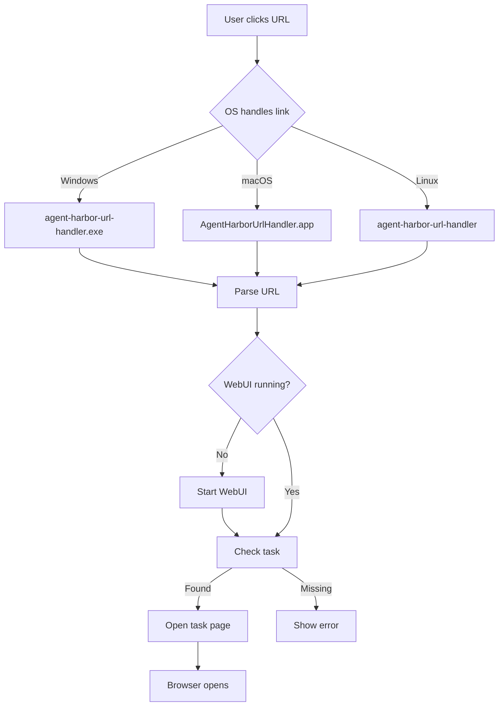

# Handling `agent-harbor://` URL Scheme

Desired behavior and UX contract for a cross‑platform custom URL handler that launches a small utility (the **AH URL Handler**) to route `agent-harbor://...` links into the local **AH WebUI** and task database.

> Target OSes: **Windows**, **macOS**, **Linux**

---

# Installing the custom URL Handler

Below are minimal, production‑safe ways to register a URL scheme named `agent-harbor` that invokes a small utility executable (the **AH URL Handler**). The handler’s job is only to parse, validate, and forward—keep it tiny and updateable.

## Windows

### Option A — Classic (unpackaged) apps via Registry (per‑user)

Create these keys (per‑user is recommended so no admin rights are needed):

```reg
Windows Registry Editor Version 5.00

[HKEY_CURRENT_USER\Software\Classes\agent-harbor]
@="URL:Agents Workflow Protocol"
"URL Protocol"=""
"DefaultIcon"="\"C:\\Program Files\\AH\\agent-harbor-url-handler.exe\",1"

[HKEY_CURRENT_USER\Software\Classes\agent-harbor\shell]

[HKEY_CURRENT_USER\Software\Classes\agent-harbor\shell\open]

[HKEY_CURRENT_USER\Software\Classes\agent-harbor\shell\open\command]
@="\"C:\\Program Files\\AH\\agent-harbor-url-handler.exe\" \"%1\""
```

**Notes**

- Use `"%1"` so the full URL is passed to the handler.
- `HKEY_LOCAL_MACHINE\Software\Classes` (system‑wide) also works but requires elevation; prefer HKCU for installers that avoid UAC prompts.
- To open a URL in the default browser from your handler, call `ShellExecuteW(NULL, L"open", L"https://…", NULL, NULL, SW_SHOWNORMAL);`.

### Option B — MSIX/Packaged apps

Declare a **Protocol** extension in the package manifest and handle **URI activation**. This is the recommended path for MSIX‑packaged apps.

## macOS

### Registering the scheme in the app’s Info.plist

Add **CFBundleURLTypes** to the bundle that will receive the URL (see the helper‑bundle pattern below):

```xml
<key>CFBundleURLTypes</key>
<array>
  <dict>
    <key>CFBundleURLName</key>
    <string>agent-harbor</string>
    <key>CFBundleURLSchemes</key>
    <array>
      <string>agent-harbor</string>
    </array>
  </dict>
</array>
```

Implement `application(_:open:)` (AppKit) or equivalent to receive the URL and forward it to the AH URL Handler logic.

#### Helper‑bundle pattern (optional with Electron)

For an **Electron‑based GUI**, you can either:

- **Register the main Electron app** as the protocol handler, or
- Embed a tiny **native helper .app** inside your Electron bundle (e.g., `MyApp.app/Contents/Resources/AgentHarborUrlHandler.app`) and register the helper as the handler. The helper parses/validates the URL and forwards it to the running Electron app over IPC (XPC/local socket) or launches the app if needed.

If you use the main Electron app:

- Register with `app.setAsDefaultProtocolClient('agent-harbor')` in the **main process**.
- Handle **macOS** deep links via `app.on('open-url', (event, url) => { ... })`.
- Handle **Windows/Linux** deep links via a **single‑instance** lock and the `'second-instance'` event; the deep link will arrive in `commandLine` (Windows/Linux) when a second instance is triggered.
- On first run, ensure the bundle is known to Launch Services (e.g., `LSRegisterURL`) so the scheme resolves reliably.

**Cross‑platform main‑process skeleton:**

```js
// main.js
const { app, BrowserWindow } = require("electron");

// Register as default protocol client (packaged apps)
if (process.defaultApp) {
  // Dev mode on Windows requires exe + args
  const path = require("node:path");
  if (process.argv.length >= 2) {
    app.setAsDefaultProtocolClient("agent-harbor", process.execPath, [
      path.resolve(process.argv[1]),
    ]);
  }
} else {
  app.setAsDefaultProtocolClient("agent-harbor");
}

// Keep a single instance to funnel deep links into one process
const gotLock = app.requestSingleInstanceLock();
if (!gotLock) app.quit();

let mainWindow;
function handleDeepLink(url) {
  // Validate/normalize the URL, then ensure WebUI → open route
}

app.on("second-instance", (event, argv) => {
  const urlArg = argv.find((a) => a.startsWith("agent-harbor://"));
  if (urlArg) handleDeepLink(urlArg);
  if (mainWindow) {
    if (mainWindow.isMinimized()) mainWindow.restore();
    mainWindow.focus();
  }
});

// macOS specific deep link event
app.on("open-url", (event, url) => {
  event.preventDefault();
  handleDeepLink(url);
});

app.whenReady().then(() => {
  mainWindow = new BrowserWindow({});
  // load your UI...
});
```

## Linux (FreeDesktop environments)

Create a `.desktop` file that declares support for the `x-scheme-handler/agent-harbor` MIME type and point it at your handler executable:

```ini
# ~/.local/share/applications/ah-url-handler.desktop
[Desktop Entry]
Name=AH URL Handler
Exec=/usr/local/bin/agent-harbor-url-handler %u
Terminal=false
Type=Application
MimeType=x-scheme-handler/agent-harbor;
```

Register it as the default handler and update caches:

```bash
xdg-mime default ah-url-handler.desktop x-scheme-handler/agent-harbor
update-desktop-database ~/.local/share/applications || true
# Inspect current handler
gio mime x-scheme-handler/agent-harbor
```

To open a URL in the default browser from your handler, execute `xdg-open "http://127.0.0.1:8787/tasks/1234"`.

> **Browser prompts:** Some browsers display an “External Protocol Request” confirmation when invoking native handlers. That UX is browser‑controlled and expected; don’t try to bypass it.

---

# Handling task URLs

The `agent-harbor://` scheme transports task intents into the local AH system. The **AH URL Handler** performs four jobs: **validate → normalize → ensure WebUI → open**. This document specifies the required behavior; implementation plans and status tracking live in the sibling [Handling AH URL Scheme.status.md](Handling-AH-URL-Scheme.status.md) file.

## URL shapes (required)

- `agent-harbor://task/<id>` → Open task result page for ID
- `agent-harbor://task/<id>?tui=1` → Also launch the TUI follow view
- `agent-harbor://create?spec=…` → (optional) Create & queue task from a spec payload, subject to the confirmation policy below.

All URLs should be purely declarative; don’t embed secrets. Reject unknown hosts/components.

## End‑to‑end behavior



### Launching the default browser

\$1**Electron (any OS)**

```js
const { shell } = require("electron");
await shell.openExternal("http://127.0.0.1:8787/tasks/1234");
```

Your handler often needs to open a local WebUI route like `http://127.0.0.1:8787/tasks/<id>`.

### Windows (Browser Launch)

Use the Shell to route to the user’s default browser:

```cpp
#include <windows.h>
#include <shellapi.h>

ShellExecuteW(NULL, L"open", L"http://127.0.0.1:8787/tasks/1234", NULL, NULL, SW_SHOWNORMAL);
```

Or from a batch script: `start "" http://127.0.0.1:8787/tasks/1234`.

### macOS (Browser Launch)

From Swift:

```swift
NSWorkspace.shared.open(URL(string: "http://127.0.0.1:8787/tasks/1234")!)
```

From a script/binary: `open "http://127.0.0.1:8787/tasks/1234"`.

## Linux

From C/Go/Rust, execute `xdg-open <url>` (or the desktop portal equivalent) and let the environment choose the default browser:

```bash
xdg-open "http://127.0.0.1:8787/tasks/1234" >/dev/null 2>&1 &
```

> **Tip:** Always validate/escape the URL you pass to the OS. Never include secrets in the query string; prefer cookies or local tokens bound to `localhost`.

---

## macOS + Electron packaging notes

- **Register protocol**: Use Electron’s **Deep Links** pattern. On macOS, include the scheme in the app’s `Info.plist` (your packager will generate this if configured). In code, call `app.setAsDefaultProtocolClient('agent-harbor')` in the **main process**.
- **Events**: Handle `app.on('open-url', ...)` on macOS, and `app.requestSingleInstanceLock()` + `'second-instance'` on Windows/Linux so a running instance processes the URL.
- **Packaging**:
  - **Electron Forge**: add `packagerConfig.protocols` with `{ name: 'Agents Workflow', schemes: ['agent-harbor'] }`, and for Linux makers set `mimeType: ['x-scheme-handler/agent-harbor']`.
  - **Electron Packager**: pass a `protocols` array in options for macOS builds.
  - **electron-builder**: set `protocols` under `mac` config; it writes `CFBundleURLTypes` in `Info.plist`. (On Linux, ensure your `.desktop` file declares `x-scheme-handler/agent-harbor`.)

- **Helper bundle (optional)**: If you embed a tiny handler `.app`, register that bundle as the URL handler and forward to the Electron app via IPC; use `LSRegisterURL` to ensure Launch Services sees the helper at install/first‑run.

---

## References (verifiable)

**Windows**

- URI activation / protocol handlers (MSIX): [https://learn.microsoft.com/en-us/windows/apps/develop/launch/handle-uri-activation](https://learn.microsoft.com/en-us/windows/apps/develop/launch/handle-uri-activation)
- `ShellExecuteW` docs (open default browser): [https://learn.microsoft.com/en-us/windows/win32/api/shellapi/nf-shellapi-shellexecutew](https://learn.microsoft.com/en-us/windows/win32/api/shellapi/nf-shellapi-shellexecutew)
- Shell launching overview: [https://learn.microsoft.com/en-us/windows/win32/shell/launch](https://learn.microsoft.com/en-us/windows/win32/shell/launch)
- Toast notifications (desktop apps): [https://learn.microsoft.com/en-us/windows/apps/develop/notifications/app-notifications/toast-notifications-overview](https://learn.microsoft.com/en-us/windows/apps/develop/notifications/app-notifications/toast-notifications-overview)

**macOS**

- `CFBundleURLTypes` (Info.plist): [https://developer.apple.com/documentation/bundleresources/information-property-list/cfbundleurltypes](https://developer.apple.com/documentation/bundleresources/information-property-list/cfbundleurltypes)
- Launch Services overview / tasks: [https://developer.apple.com/documentation/coreservices/launch_services](https://developer.apple.com/documentation/coreservices/launch_services)
- Register app with Launch Services `LSRegisterURL`: [https://developer.apple.com/documentation/coreservices/1446350-lsregisterurl](https://developer.apple.com/documentation/coreservices/1446350-lsregisterurl)
- Programmatically set default handler for a scheme: [https://developer.apple.com/documentation/coreservices/1447760-lssetdefaulthandlerforurlscheme](https://developer.apple.com/documentation/coreservices/1447760-lssetdefaulthandlerforurlscheme)
- `NSWorkspace.open` to open URLs: [https://manpagez.com/man/1/open/](https://manpagez.com/man/1/open/)

**Linux (FreeDesktop)**

- XDG MIME Applications (scheme handling via `x-scheme-handler/<scheme>`): [https://wiki.archlinux.org/title/XDG_MIME_Applications](https://wiki.archlinux.org/title/XDG_MIME_Applications)
- Desktop Notifications spec (for completion toasts): [https://specifications.freedesktop.org/notification-spec/latest/](https://specifications.freedesktop.org/notification-spec/latest/)
- `gio mime` manual: [https://man.archlinux.org/man/gio.1](https://man.archlinux.org/man/gio.1)
- `xdg-open` manual: [https://man.archlinux.org/man/xdg-open.1](https://man.archlinux.org/man/xdg-open.1)

**Electron**

- Deep Links tutorial (protocol handlers & cross‑platform patterns): [https://www.electronjs.org/docs/latest/tutorial/launch-app-from-url-in-another-app](https://www.electronjs.org/docs/latest/tutorial/launch-app-from-url-in-another-app)
- `app` API: `'open-url'` (macOS), `requestSingleInstanceLock`, `setAsDefaultProtocolClient`: [https://www.electronjs.org/docs/latest/api/app](https://www.electronjs.org/docs/latest/api/app)
- `shell.openExternal` to open default browser: [https://www.electronjs.org/docs/latest/api/shell](https://www.electronjs.org/docs/latest/api/shell)
- Electron Forge configuration for protocols (see Deep Links page): [https://www.electronjs.org/docs/latest/tutorial/launch-app-from-url-in-another-app](https://www.electronjs.org/docs/latest/tutorial/launch-app-from-url-in-another-app)
- electron-builder `protocols` config: [https://www.electron.build/app-builder-lib.interface.protocol](https://www.electron.build/app-builder-lib.interface.protocol)

---

## Security & UX checklist

- Validate URL inputs strictly; reject unknown commands and malformed IDs.
- Use per‑machine ephemeral tokens or session cookies for WebUI auth rather than query strings.
- Prefer per‑user registration (HKCU on Windows, `~/.local/share/applications` on Linux) to avoid elevation.
- Expect browser “Open external application?” prompts and document that for users.
- Make the handler idempotent (re‑entry on already‑running tasks should just focus the page).

## Required Behaviors and Constraints

### Scope and Goals

- Provide a tiny, updateable native executable that is the OS‑registered handler for `agent-harbor://…` links.
- Responsibilities: validate → normalize → ensure WebUI/TUI → open/focus. Avoid business logic; delegate to AH CLI/WebUI/REST.
- Must work without elevation and respect per‑user registration where possible.

### URL Forms and Validation

- Supported forms:
  - `agent-harbor://task/<id>` → open WebUI task page
  - `agent-harbor://task/<id>?tui=1` → open WebUI task page and also launch TUI follow view
  - `agent-harbor://create?spec=<payload>` → optional fast path to create and queue a task from a payload
- Validation:
  - `<id>` MUST be `^[A-Za-z0-9_-]{6,128}$` (ULID/UUID/slug subset). Reject otherwise.
  - Reject unknown hosts and extra path segments.
  - For `spec`, accept percent‑encoded UTF‑8 text. Do not require secrets; reject payloads over 256KB.

### Configuration and Defaults

- Read AH layered config (see [Configuration.md](Configuration.md)): `${configDirs}/agent-harbor/config.toml`.
- Keys used:
  - `ui`: default UI (`tui` or `webui`) when needing an auxiliary view.
  - `remote-server`: when set, prefer REST paths; otherwise local SQLite paths.
  - `service-base-url`: when running a persistent WebUI at a fixed origin (enterprise). In local mode, default to `http://127.0.0.1:<port>`.
- Local defaults (align with [CLI.md](CLI.md) examples): WebUI `127.0.0.1:8080`, REST `127.0.0.1:8081` unless overridden.

### Discovery and Startup Strategy

1. Resolve target WebUI URL
   - If `service-base-url` is an HTTP(S) origin, compute WebUI base from it (documented enterprise mode).
   - Otherwise, discover local WebUI:
     - Check AH GUI IPC (if present) for current WebUI URL.
     - Check PID/state file: `${cacheDir}/agent-harbor/webui.json` with `{ pid, url, startedAt }`.
     - Probe candidates `http://127.0.0.1:8080` (and any configured port) for an `/_ah/healthz` endpoint (served by WebUI process).

2. Ensure WebUI is running
   - If no responsive WebUI is found, start it using the CLI:
     - `ah webui --local --port <port> --rest http://127.0.0.1:8081`
     - Wait up to 5s (configurable) for `/_ah/healthz` to respond 200.
   - If REST is required by the WebUI and is not responding at the configured URL, optionally start it:
     - `ah serve rest --local --port 8081` (non‑interactive, background) and wait for `/api/v1/readyz`.
   - If AH GUI is installed, prefer delegating “ensure WebUI” to the GUI via IPC; otherwise fall back to CLI.

3. Optional task existence check (best‑effort)
   - If URL is `task/<id>` and REST is reachable, attempt `GET /api/v1/sessions/<id>`:
     - On 200: proceed to open.
     - On 404/Network error: still open the WebUI route; the UI will render a Not Found banner.

### Action Mapping per URL

- `task/<id>`:
  - Ensure WebUI is running.
  - Open default browser to `${webuiBase}/tasks/<id>`.
  - If an Electron shell (AH GUI) is hosting the WebUI, prefer delegating focus and navigation via IPC to the GUI main process so the existing window/tab is reused; else open in the OS default browser.

- `task/<id>?tui=1`:
  - Perform the same as `task/<id>`.
  - If a TUI session is already tracking this task, prefer reusing that exact terminal window instead of launching a new one (see “TUI Window Reuse” below).
  - Otherwise start: `ah tui --follow <id>` (non‑blocking). Multiplexer selection from config or default.

- `create?spec=<payload>` (optional capability):
  - MUST enforce a user confirmation dialog before any task creation (see “Create Flow Confirmation” below).
  - If `remote-server` is set: try `POST /api/v1/tasks` with the payload; on success, get an `id` and open `${webuiBase}/tasks/<id>`.
  - Otherwise (local mode): write the payload to a temp file and run `ah task --prompt-file <file> --non-interactive`. On success, parse the emitted `taskId` and open WebUI to its page.
  - If the user cancels or creation fails, open `${webuiBase}/create` with prefill via local handoff (see “Security and Hand‑Off”) or show an error toast.

### Security and Hand‑Off

- Never include secrets in query strings. For `create` hand‑off, prefer one of:
  - Local hand‑off file: `${cacheDir}/agent-harbor/inbox/<random>.json` referenced as `${webuiBase}/create?inbox=<random>`; the WebUI reads and deletes locally via a small helper endpoint hosted by the WebUI process.
  - Or, when REST is available, POST the spec and navigate to the created task.
- Bind all local HTTP servers to `127.0.0.1` only (see WebUI Local Mode in [WebUI-PRD.md](WebUI-PRD.md)).
- Use short timeouts and idempotent restarts. Avoid privilege elevation.

#### Create Flow Confirmation (required)

- Rationale: Clicking a custom URL from an arbitrary website must not lead to silent local code execution.
- Policy: For any `agent-harbor://create?...` invocation, the handler MUST present a native confirmation dialog owned by the handler process, even if the browser already displayed an external‑protocol confirmation.
- Dialog content (minimum):
  - Title: “Create Agent Harbor Task?”
  - Source context: browser name (when detectable) and referring host (if provided), otherwise “unknown source”.
  - Precise action summary: the prompt title or first 120 chars; agent type; where it will run (local or remote server hostname); snapshot mode; network policy; and whether files, repos, or credentials will be accessed.
  - Buttons: “Create Task” (default) and “Cancel”.
  - A checkbox: "Always require confirmation for task creation" (default ON) and an optional per‑source trust rule ("Trust this site for 1 hour"), stored in the handler's local trust store. Global policy toggles live in [Configuration.md](Configuration.md).
- Behavior:
  - If the user cancels, NO task is created and the dialog closes.
  - If confirmed, proceed with the creation flow (REST or local CLI), then navigate to the created task page.
  - The dialog MUST NOT render arbitrary HTML from the payload; only render safe, escaped summaries.

### TUI Window Reuse (required)

When the URL includes `tui=1` or when the user’s preference indicates a TUI‑first workflow, the handler should prefer showing the task in an existing terminal window that is already following the task, instead of launching a new TUI instance.

Mechanism:

- The TUI maintains a small control socket and index file, e.g., `${XDG_RUNTIME_DIR:-/tmp}/agent-harbor/tui.sock` and `${STATE_DIR}/tui-sessions.json`, mapping `taskId → { mux: tmux|wezterm|kitty, windowId/paneId, terminal: appId, hintTitle }`.
- The handler queries the socket or reads the index to determine whether a live session exists for the given task id.
- If present:
  - For `tmux`: run `tmux select-window -t <windowId>` and `tmux select-pane -t <paneId>`.
  - For WezTerm: invoke `wezterm cli activate --window-id <id>` (if enabled) and `wezterm cli activate-pane --pane-id <id>`.
  - For Kitty: use `kitty @ focus-window --match title:<hintTitle>`.
  - On macOS, if necessary, bring the terminal app to front via AppleScript/JXA using the recorded `appId`/window title.
  - On Windows, use the Windows Terminal `wt.exe` commandline or the ConPTY host API (when available) to activate the window; otherwise fall back to opening WebUI.
- If not present: start `ah tui --follow <id>` in the preferred multiplexer/terminal from config.
- The handler SHOULD avoid stealing focus when a browser tab is in fullscreen unless the OS allows safe attention requests (bounce dock/taskbar or flash window).

### OS Integrations (registration kept minimal)

- Windows: HKCU registration (see registry snippet above). Binary path points to `ah-url-handler.exe`.
- macOS: `CFBundleURLTypes` for the helper bundle or register via Electron (`open-url` event). Binary: `AH URL Handler.app` or a CLI shim. When AH GUI is installed, the GUI registers as the protocol handler and proxies URL handling to its main process.
- Linux: `.desktop` with `MimeType=x-scheme-handler/agent-harbor` pointing to `ah-url-handler %u`.

### Packaging and Update Strategy

- Build a single small Rust binary (`ah-url-handler`) per platform with static runtime. Keep startup under 50ms.
- Ship as part of AH GUI and as a standalone package. On GUI installs, the GUI registers itself as protocol handler and proxies to the same flow via IPC.
- Provide a feature flag to prefer GUI IPC when present: the handler immediately forwards the deep link to the GUI and exits.

### Telemetry and Logging

- Write minimal rotating logs to `${cacheDir}/agent-harbor/logs/url-handler.log` with:
  - timestamp, URL, action taken, durations, and errors (no secrets).
- On user‑visible failures, show OS notification with an actionable message and a button to open troubleshooting docs.
